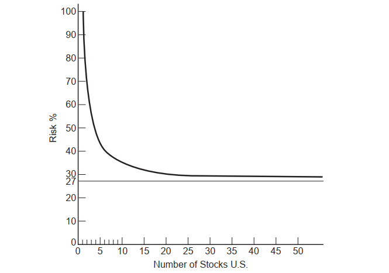
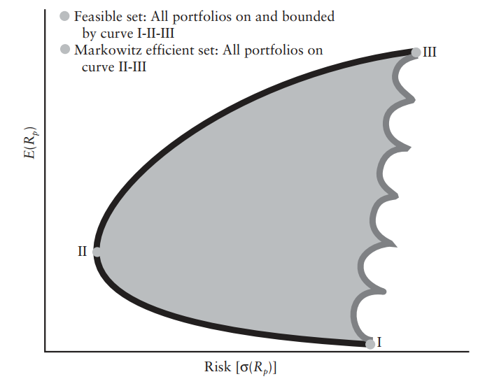
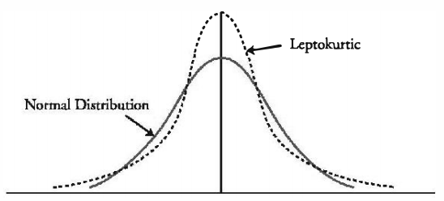

\begingroup
\titleformat{\chapter}[display]
{\normalfont\huge\bfseries\centering}{\chaptertitlename\ \thechapter}{20pt}{\Huge}
# Modelação Estatística na Otimização de Portfólios
\newpage

```{r, include=FALSE}
knitr::opts_chunk$set(tidy=FALSE, message = FALSE,warning =  FALSE,fig.align = "center",fig.show = "hold")
```

## Series Temporais

O valor da cotação de activos financeiros, como acções ou opções, são representados de forma sequencial ao longo do tempo, considerando determinado intervalo, que pode ser segundos, minutos, dias, semanas ou outro intervalo considerado útil para representação dos dados ao longo do tempo. Quando tal acontece estamos em presença de series temporais.

Os preços de activos financeiros ao longo do tempo formam o que é denominado por processos estocásticos. Processos estocásticos são uma classe de series temporais onde o valor da variável muda ao longo de tempo de forma aleatória. Os processo estocásticos podem ser classificados de discretos ou contínuos, sendo que na análise de activos financeiros, embora estes sigam processos discretos, serão considerados processos estocásticos contínuos ao longo do tempo, sendo que estes modelos acabam por ser bastante úteis na modelização dos preços de activos financeiros de acordo com @Hull2018.

### Modelação do preço de acções

Os preços das acções seguem habitualmente o que é conhecido por um processo de Markov, onde apenas o valor presente importa para prever o valor futuro. Desta forma a única informação relevante é o seu valor no momento, sendo que os valores e trajecto verificado no passado não irão ter importância na definição da distribuição probabilística do preço no futuro [@Hull2018].Desta forma as propriedades de Markov no preço das acções é consistente com a eficiência dos mercados na forma fraca, constituindo esta uma das três formas de eficiência de mercado definidas por Eugene Fama^[Ver "https://pt.wikipedia.org/wiki/Eugene_Fama"].

O modelo representado aqui e que será utilizado para simular preços de activos financeiros atravessou vários pressupostos até a sua conclusão final, sendo apresentado de uma forma muito sucinta as principais etapas de desenvolvimento desse modelo.

Um dos primeiros modelos era representado por um processo de Wiener, sendo este um processo particular do processo estocástico Markov, referido como movimento Browniano, descrevendo a evolução de uma variável com distribuição normal padrão. A modelação pressupõe que a variável z possa ser dada pela seguinte equação:

\begin{equation} 
  dz = \varepsilon \sqrt{dt}\qquad   \varepsilon \sim N(0,1);
  (\#eq:wiener)
\end{equation} 

Desta forma a variável z segue um processo de Wiener, sendo uma variável independente e identicamente distribuída (i.i.d). 

Como este modelo não preenchia todos os pressupostos, aplicou-se um processo generalizado de Wiener (também conhecido como movimento Browniano (BM)), onde é incluindo um amplificador/redutor na parte aleatória do processo de forma a ajustar o processo a propriedades especificas de cada acção, ilustrado na equação \@ref(eq:gwiener). Este processo descreve a evolução de um processo de uma variável com distribuição normal, com um desvio $\mu$ por unidade de tempo e uma taxa de variância de $\sigma^2$ também por unidade de tempo. 
 
\begin{equation} 
  \delta S = \mu\delta t +\sigma\varepsilon\sqrt{\delta t}\qquad\varepsilon \sim N(0,1);
  (\#eq:gwiener)
\end{equation} 

A diferença relativo a um processo de Wiener é que no processo generalizado de Wiener a taxa de desvio e variância pode ter como valor qualquer constante, sendo que no processo de Wiener esses valores são de 0 e 1 respectivamente.

Outro processo estocástico, conhecido como processo Itô, foi desenvolvido, representando um processo generalizado de Wiener, sendo que neste caso o valor dos parâmetros $\mu$ e $\sigma$ são funções do valor subjacente da variável S e do tempo t. Este modelo é o que vai ser utilizado para simulação do preço das acções sendo representado pelas seguintes equações:

\begin{equation} 
  \frac{\delta S}{S} = \mu\delta t +\sigma\varepsilon\sqrt{\delta t}\qquad\varepsilon \sim N(0,1);
  (\#eq:ito)
\end{equation} 
\begin{equation} 
  In S_1 - InS_0 \approx\phi\Big[\Big(\mu-\frac{\sigma^2}{2}\Big)\delta t, \sigma\sqrt{\delta t}\Big]
  (\#eq:Inito)
\end{equation} 
\begin{equation} 
  S_1 =S_0 e^{\Big(\mu-\frac{\sigma^2}{2}\Big)\delta t + \sigma\varepsilon\sqrt{\delta t}}
  (\#eq:logprice)
\end{equation} 

Nesta equação o $\mu$ representa a taxa de retorno anual esperado, sendo que $\sigma$ representa o desvio padrão ou volatilidade da acção, parâmetro muito importante para a determinação do valor de vários derivados, havendo várias formas de calcular este valor como veremos mais adiante. Estes valores são função do corrente valor de S e do tempo actual t. Numa economia neutra face ao risco $\mu$ é igual a taxa de juro sem risco. O $\varepsilon$ representa uma variável com distribuição normal(N(0,1)). 

Este processo é conhecido como movimento Browniano geométrico (GBM). De acordo com @AppliedFinancial um "GBM pode ser considerado como um movimento probabilístico contínuo no qual o logaritmo da quantidade que varia aleatoriamente segue um movimento Browniano (processo de Wiener) com desvio." Este modelo é a base do modelo de Black-Scholes, que será revisto mais adiante, aquando do cálculo da volatilidade implícita nas opções.

Tendo em consideração a equação \@ref(eq:logprice), *S* segue uma distribuição lognormal. Uma distribuição lognormal é mais realístico de acordo com o movimento do preço das acções, prevenindo que o valor se torne negativo.

Em simulação, este processo é realizado considerando uma distribuição normal com média e variância dada pela equação \@ref(eq:Inito) [@FRM1].

### Simulação de Monte Carlo

A simulação de Monte Carlo consiste na geração de valores a partir de uma determinada distribuição ou amostra, sendo que "o termo Monte Carlo é usado para se referir a técnicas que envolvem simulação computacional"[@ProgSim,pp.457]. 

Ao simular os preços dos activos financeiros iremos utilizar a técnica de Monte Carlo de modo a gerar amostras aleatórias de acordo com a equação \@ref(eq:logprice). Os preços serão simulados criando várias tentativas com valores aleatórios para $\varepsilon$ a partir de $\phi$(0,1). A precisão dos valores obtidos na simulação depende do número de tentativas efectuadas, sendo considerado 1000 tentativas por cada dia e considerar o valor médio dessas tentativas como o valor simulado para cada um dos dias simulados.

## Volatilidade

Na indústria financeira o desvio padrão associado a instrumentos financeiros é definido como volatilidade. Desta forma quando estamos a falar de volatilidade estamos a considerar o desvio padrão observado.

De acordo com @HullRisk2018:
\begin{spacing}{1}
\begin{adjustwidth}{28.3464pt}{28.3464pt}\footnotesize
"A variável volatilidade, $\sigma$, é definida como o desvio padrão do retorno fornecido pela variável por unidade de tempo quando o retorno é expresso usando juros compostos. Quando a volatilidade é usada para valorizar opções, a unidade de tempo é normalmente 1 ano, sendo a volatilidade o desvio padrão do retorno compostos por ano. Quando a volatilidade é usada para a gestão de risco, a unidade de tempo usual é 1 dia de forma a que a volatilidade é o desvio padrão do retorno composto por dia." (pp.213-214)
\normalsize\end{adjustwidth}
\end{spacing}
\medskip
Vários são os modelos para calculo da volatilidade, sendo que um dos modelos mais simples é o do cálculo da variância de acordo com a equação \@ref(eq:estdesviopadrao) utilizando os dados históricos dos retornos, sendo que neste modelo o peso atribuído aos dados é o mesmo independentemente da sua antiguidade. Outros modelos como a Média Móvel Exponencial Ponderada (EWMA) e Heteroscedasticidade condicional auto-regressiva generalizada (GARCH) são modelos, que embora utilizem dados históricos, reconhecem que tanto a volatilidade como a correlação não são constantes ao longo do tempo, atribuindo maior peso aos dados mais recentes. Por fim, um dos modelos que não integra dados históricos mas sim as expectativas futuras para o cálculo da volatilidade é o da volatilidade implícita, utilizando o modelo de Black-Scholes-Merton na valorização das respectivas opções relativamente ao subjacente.

Nos cálculos que utilizem dados históricos a escolha do tamanho da amostra *n* deve ser grande o suficiente de modo a garantir uma melhor precisão nas estatísticas obtidas, sendo que neste caso devemos considerar que a volatilidade não é constante ao longo do tempo e que valores mais antigos podem não ser tão relevantes como os valores mais recentes. De acordo com [@Hull2018] esse valor deve ser compreendido entre 90 a 180 dias para a cotação de activos. 

Para o calculo da volatilidade anual utiliza-se os número de dias de negociação, sendo considerado 252 dias por ano como valor de referência.

### AutoRegressive Conditional Heteroscedasticity (ARCH)

Existem equações para o cálculo da variância que atribuem igual peso aos valores passados independentemente da sua antiguidade. Outros métodos atribuem mais peso aos dados mais recentes, pois pressupõem-se que esses carregam mais informação útil acerca da variável em estudo, criando modelos que prevêem com menor erro os valores futuros em estudo.

Uma das formas de cálculo da volatilidade tendo em consideração os valores mais recentes dos retornos é aplicando a equação

\begin{equation} 
  \sigma_{n}^{2} =\sum_{i=1}^{m}\alpha_i\mu_{n-1}^{2}
  (\#eq:weight)
\end{equation} 

A variável $\alpha$ representa o peso associado a observação *i* dos retornos, sendo que a soma dos respectivos pesos deve ser igual a 1.

Tendo em consideração @Hull2018 se a média a longo prazo da taxa de variância for considerada e assignado um peso a ela então teremos

\begin{equation} 
  \sigma_{n}^{2} =\gamma\mathcal{V}_{L}+\sum_{i=1}^{m}\alpha_i\mu_{n-1}^{2}
  (\#eq:arch)
\end{equation} 

sendo que $\mathcal{V}_{L}$ é a taxa de variância de longo prazo e $\gamma$ é o peso associado a cada $\mathcal{V}_{L}$, sendo que os repectivos pesos devem somar 1, de acordo com $$\gamma + \sum_{i=1}^{m}\alpha_i = 1$$


A equação \@ref(eq:arch) é conhecida como um modelo *AutoRegressive Conditional Heteroscedasticity* ou ARCH(m)^[Introduzido por Robert F.Engle em 1982, tendo-lhe sido atribuído o prémio Nobel da economia em 2003], sendo que em finanças é uma das classes de modelos mais utilizada para prever a volatilidade. O *m* representa o número de observações, sendo que a variável aleatória $\mu$ segue uma distribuição normal, sendo no entanto prática comum considerar outros tipos de distribuições como a distribuição t-student, devido ao factos da distribuição dos retornos apresentarem caudas mais pesadas que uma distribuição normal.

Auto-regressivo significa que a variância presente depende do seu próprio passado e não num regressor exógeno. O facto de ser condicional significa que a variância de amanhã depende das variâncias mais recentes. Já a heteroscedasticidade significa que a variância não é constante ao longo do tempo. Quando a variância e a covariância variam ao longo do tempo falamos de heteroscedasticidade condicional.

O pressuposto destes modelos é de que a variância dos retornos seguem um processo previsível, sendo que os modelos ARCH são menos convincentes na previsão quando a volatilidade têm alterações bruscas. A apresentação do modelo ARCH serve como forma introdutória de apresentação aos modelos *exponentially weighted moving average* (EWMA) e *generalized autoregressive conditional heteroskedasticity* (GARCH).

### Exponentially weighted moving average (EWMA)

O modelo da média móvel exponencial ponderada (EWMA) é um estimador calculado a partir de amostras sequenciais da população onde é atribuindo maior peso aos valores mais recentes, sendo que esse peso diminui exponencialmente a medida que vamos recuando no tempo. A formula utilizada para actualizar o valor para a volatilidade é

\begin{equation} 
  \sigma_{n}^{2} = \lambda\sigma_{n-1}^{2}+(1-\lambda)\mu_{n-1}^{2} 
  (\#eq:ewma)
\end{equation} 
sendo um caso particular da equação \@ref(eq:weight). Neste caso $\gamma_{i+1} = \lambda\gamma_{i}$, onde 0<$\lambda\leq1$ é uma constante, sendo $\sigma_{n-1}$ a estimativa da volatilidade realizada no dia n-2 para o dia n-1, e $\mu_{n-1}$ a mudança percentual diária mais recente. Ao valor de $\lambda$ atribuido "estudos empíricos mostram que o *decay factor* ($\lambda$) 0,94 fornece uma boa estimativa para todos os ativos."[@riskmetrics,p.4]

De modo a entender porque à volatilidade obtida através da EWMA correspondem pesos que diminuem exponencialmente vamos substituir $\sigma_{n-1}^{2}$ na equação \@ref(eq:ewma) de modo a obter

\begin{equation} 
  \sigma_{n}^{2} = (1-\lambda)(\mu_{n-1}^{2}+\lambda\mu_{n-2}^{2})+\lambda^{2}\sigma_{n-2}^{2}
  (\#eq:ewma1)
\end{equation} 

Continuando a substituir acabamos por obter

\begin{equation} 
  \sigma_{n}^{2} = (1-\lambda)\sum_{i=1}^{m}\lambda^{i-1}\mu_{n-1}^{2}+\lambda^{m}\mu_{n-m}^{2}
  (\#eq:ewma2)
\end{equation} 

Como podemos ver pela equação \@ref(eq:ewma2) o "peso de $\mu_{i}$ decresce a uma taxa $\lambda$ a medida que vamos recuando no tempo. Cada peso é $\lambda$ vezes o peso anterior." [@HullRisk2018,p.226]. Como os pesos diminuem geometricamente, o EWMA também é referido como média móvel geométrica. 

### Generalized autoregressive conditional heteroskedasticity (GARCH)

Em 1986 um modelo mais flexível que o modelo ARCH foi proposto, sendo este o modelo *Generalized* ARCH^[Introduzido por Bollerslev(1986)]. De acordo com @volatilitymodels "Uma grande vantagem dos modelos GARCH é que os retornos não são assumidos independentes, e mesmo se forem assumidos condicionais gaussianos para retornos anteriores, incondicionalmente, eles não são gaussianos, porque o agrupamento de volatilidade gera leptocurtose"(p.2). Também, e de acordo com @portanalyse, "A volatilidade agora depende de ambos, uma combinação linear dos erros quadráticos da previsão (um termo autoregressivo) e variâncias condicional passada (um termo de média móvel)."(p.136)

A equação que define o modelo GARCH(1,1) é

\begin{equation} 
  \sigma_{n}^{2} = \gamma\mathcal{V}_{L} + \alpha\mu_{n-1}^{2} + \beta\sigma_{n-1}^{2}
  (\#eq:garch)
\end{equation}

Nesta equação, verifica-se que $\sigma_{n}^{2}$ é calculado a partir da taxa de variação média de longo prazo $\mathcal{V}_{L}$, como também a partir de $\sigma_{n-1}$ e $\mu_{n-1}$, sendo que o modelo EWMA é um caso particular do modelo GARCH(1,1) onde $\gamma=0$, $\alpha=1-\lambda$ e $\beta=\lambda$. Tal como referido nos modelos anteriores, a soma dos diferentes pesos deve ser igual a 1, sendo $$\gamma+\sigma+\beta=1$$

O modelo genérico de GARCH é GARCH(p,q) onde o modelo calcula $\sigma_{n}^{2}$ a partir das observações *p* mais recentes de $\mu^2$ e as mais recentes estimações *q* da taxa de variância. Desta forma, o modelo ""(1,1) em GARCH(1,1) indica que $\sigma_{n}^{2}$ é baseado nas mais recentes observações de $\mu^2$ e nas mais recentes estimações da taxa de variância."[@Hull2018,p.227]

Considerando $\omega=\gamma\mathcal{V}_{L}$, o modelo GARCH(1,1) pode ser definido como

\begin{equation} 
  \sigma_{n}^{2} = \omega + \alpha\mu_{n-1}^{2} + \beta\sigma_{n-1}^{2}
  (\#eq:garch2)
\end{equation}

A equação \@ref(eq:garch2) é a que costuma ser utilizada de forma a estimar os parâmetros. De notar de que para obter um processo estável GARCH(1,1) é necessário que $\sigma+\beta<1$, ou então o peso aplicado a variância de longo prazo é negativa.
A estimação dos parâmetros, tanto para o modelo EWMA como para o modelo GARCH(1,1), é realizado utilizando um processo conhecido como *maximum likelihood method*, onde se utilizam os dados históricos de modo a escolher os parâmetros que maximizem a probabilidade de ocorrência dos dados, de acordo com a equação

\begin{equation} 
  \sum_{i=1}^{m}=\bigg[-ln(\sigma_{i}^{2})-\frac{\mu_{i}^{2}}{\sigma_{i}^{2}}\bigg]
  (\#eq:mgarch)
\end{equation}

### Volatilidade implícita

O modelo de Black-Scholes-Merton^[Os autores, Robert Merton e Myron Scholes, foram reconhecidos com o Nobel da economia em 1997] foi um modelo desenvolvido nos anos 70, considerado um ponto de ruptura na definição do preço de opções sobre acções europeias. 

De entre os pressupostos^[Para mais informação ver @BlackScholes,pp. 640, capitulo "The valuation formula"] utilizados para derivar a equação diferencial, importa salientar de que a taxa de juro sem risco, r, é constante e a mesma ao longo do tempo. De acordo com @Hull2018 "É importante considerar que a avaliação sem risco (ou o pressuposto de que todos os investidores são neutros ao risco) é meramente um artifício para obter solução para a equação diferencial de Black-Scholes-Merton"(p.312).

O processo que se assume ser aplicado ao preço dos activos é o descrito pela equação \@ref(eq:ito). De salientar de que nenhumas das variáveis da equação é afectada pelas preferências de risco dos investidores, sendo que as variáveis que aparecem na equação são o valor presente do activo financeiro, tempo, volatilidade e a taxa de juro sem risco. 

As soluções obtidas a partir da equação diferenciável de interesse para calculo da volatilidade implícita, são as aqui apresentadas para valorizar opções de compra (*call*) e opções de venda (*put*) do tipo europeias:

\begin{equation} 
  c = S_0N(d_1) - Ke^{-rT}N(d_2);
  (\#eq:call)
\end{equation} 
e
\begin{equation} 
  p = Ke^{-rT}N(-d_2) - S_0N(-d_1);
  (\#eq:put)
\end{equation} 
onde
\begin{equation} 
  d_1 = \frac{In(S_0/K)+(r+\sigma^2/2)T}{\sigma\sqrt{T}}
  (\#eq:d1)
\end{equation}
\begin{equation} 
  d_2 = \frac{In(S_0/K)+(r-\sigma^2/2)T}{\sigma\sqrt{T}}=d_1-\sigma\sqrt{T}
  (\#eq:d2)
\end{equation}

A função N(x) representa a função distribuição para uma distribuição normal padrão, sendo a probabilidade de uma variável ser menor que x (ver exemplo na figura \@ref(fig:fdistribuicao)). O valor de N(x) pode ser obtido com a função do R pnorm(). A variável T representa o tempo medido em dias de negociação que faltam até a expiração da opção dividido pelos dias de negociação nesse ano, sendo S~0~ o valor do activo subjacente no tempo 0, r a taxa de juro sem risco, $\sigma$ a volatilidade anual e K o preço de exercício da opção.
```{r, fdistribuicao,echo=FALSE,fig.cap='Função distribuição N(x)',out.width="45%"}
knitr::include_graphics("image/fdistribuicao.png")
```
\FloatBarrier
\centering 
Fonte: Elaboração própria.

\justifying
\bigskip

O parâmetro da volatilidade não é um parâmetro que se consiga obter ou observar directamente, sendo um valor que representa a volatilidade esperada pelos investidores no futuro, conhecido como *volatilidade implícita*. Um modo de obter este valor é a partir dos restantes parâmetros, ou seja, tendo o valor de uma opção de compra, e considerando os valores de S~0~, K, r e T, substituir estes pelos respectivos valores e obter o valor de $\sigma$ que iguale o valor da *call* utilizando as equações \@ref(eq:call) e \@ref(eq:d1) através de processos por aproximação iterativo. 

A volatilidade implícita será diferente consoante o preço de exercício da opção, considerando todos os outros parâmetros iguais. Da conjugação dos valore de volatilidade obtidos para cada um dos preços de exercício da opção obtêm-se um gráfico conhecido como *volatility smile*(figura \@ref(fig:volatilitysmile)). Este gráfico será o mesmo, quer se esteja a considerar uma opção do tipo *call* ou a mesma equivalente opção do tipo *put*.

A variável volatilidade, $\sigma$, é definida como o desvio padrão do retorno fornecido pela
variável por unidade de tempo quando o retorno é expresso usando juros compostos.
Quando a volatilidade é usada para valorizar opções, a unidade de tempo é normalmente 1 ano, sendo a volatilidade o desvio padrão do retorno compostos por ano.
Quando a volatilidade é usada para a gestão de risco, a unidade de tempo usual é 1 dia
de forma a que a volatilidade é o desvio padrão do retorno composto por dia.”(pp.213-
214)
```{r, volatilitysmile,echo=FALSE,fig.cap='Volatility Smile',out.width = "60%"}
knitr::include_graphics("image/volatilitysmile.png")
```
\FloatBarrier
\centering 
Fonte: [@volatilitysmile, pp.182]

\justifying
\bigskip
Como de pode ver pela figura \@ref(fig:volatilitysmile) a opção é considerada *out-the-money* se o seu valor for inferior ao do respectivo subjacente, *at-the-money* se for superior e *in-the-money* se o valor for igual. No calculo do valor da volatilidade será utilizado o valor de preço de exercício *in-the-money* de opções do tipo *call*, ou na impossibilidade do valor do subjacente ser o mesmo do K, o mais próximo deste.

Quando comparado com outros métodos para calcular a volatilidade onde os dados utilizados são dados históricos, este método incorpora o sentimento presente dos investidores relativo a volatilidade futura de um determinado ativo ou instrumento financeiro.

## Portfolios média-variância

A otimização de portfolios através da diversificação é um conceito básico que teve origem em Markowitz, criando o conceito de fronteira eficiente. Existem vários pressupostos definidos na obtenção deste modelo, não sendo, no entanto, o âmbito aqui analisar esses mesmos pressupostos, considerando que independentemente disso esses mesmos pressupostos são verificados. De acordo com @Modern2013, “todas os pressupostos acerca da analise de portfolio foram demonstradas serem simplistas, e em alguns casos demasiado simplistas.[...]Pessoas necessitam apenas de se comportar como se fossem descritas pelos pressupostos para uma teoria ser válida” [@Modern2013,pp.5]. 

Para aplicação deste modelo deve-se obter os seguintes dados dos instrumentos financeiros que vão constituir o portfolio:

- A taxa do retorno esperado, E(r);
- O desvio padrão dos retornos, $\sigma$;
- O coeficiente de correlação,$\rho$, entre cada um dos activos.

O retorno esperado vai depender de vários factores, essencialmente a taxa de retorno sem risco que se verifica no mercado, a taxa de inflação e o risco a que o investidor estará sujeito, sendo que quanto maior o risco, maior será o retorno esperado.

As séries dos retornos diários para cada um dos activos é calculada de acordo com a seguinte formula:

\begin{equation} 
  R_i = ln\Big(\frac{S_f}{S_i}\Big)
  (\#eq:logRet)
\end{equation} 

A média dos retornos de cada um dos activos é calculada de acordo com a sua média aritmética:

\begin{equation} 
  \overline{R} = \frac{\displaystyle\sum_{i=1}^n R_i}{n}
  (\#eq:meanRet)
\end{equation}  

O retorno de um portfolio de activos financeiros será uma média ponderada do retorno dos activos individuais, de acordo com a seguinte equação

\begin{equation} 
    R_{p} = \sum_{i=1}^{N}(X_{i}R_{ij})
  (\#eq:retp)
\end{equation}
onde $X_{i}$ representa a fracção investida no activo *i*.

O desvio padrão representa a volatilidade, ou risco, associada ao activo. Considerando que essa volatilidade é calculada com base nos dados históricos e nas formulas acima, então a estatística da amostra para o desvio padrão representa-se pela seguinte formula:

\begin{equation} 
  \hat{\sigma} = \sqrt\frac{\displaystyle\sum_{i=1}^n (R_i-\overline{R})^2}{n-1}
  (\#eq:estdesviopadrao)
\end{equation} 

A variância para o portfolio é um pouco mais complicada a calcular do que o calculo para o retorno e para as variância individuais de cada um dos activos, como podemos verificar pela seguinte equação

\begin{equation} 
  \sigma_{p}^{2} = \sum_{j=1}^{N}(X_{j}^{2}\sigma_{j}^{2})+\sum_{j=1}^{N}\sum_{k=1}^{N}(X_{j}X_{k}\sigma_{jk})
  (\#eq:estdesviopadraop)
\end{equation} 
onde $k\neq j$. O termo $\sigma_{jk}$ designa-se por covariância representando o modo como 2 activos se movem conjuntamente, sendo o valor calculado do seguinte modo,

\begin{equation} 
  Cov(R_{i},R_{j}) = E([R_{i}-E(R_{i})][R_{j}-E(R_{j})])
  (\#eq:covariancia)
\end{equation} 

Se todos os termos forem independentes, isto é, a covariância for igual a 0, então apenas se mantêm o primeiro termo/somátorio na equação\#ref(eq:estdesviopadraop).

Quando se pretende interpretar o valor da covariância é prática comum utilizar o que se designa por coeficiente de correlação, sendo que o valor obtido varia entre -1 e +1, sendo que o -1 representa uma correlação negativa perfeita e o +1 uma correlação positiva perfeita. Se o valor for 0 então não existe relação linear entre as variáveis. De forma genérica podemos afirmar que a correlação mede a força da relação linear entre 2 variáveis, sendo a sua forma matemática $$\rho_{ij}=\frac{\sigma_{ij}}{\sigma_{i}\sigma_{j}}$$
Aos incluir-mos mais activos no nosso portfolio estamos a diversificar o risco e a diminuir a variância esperada do portfolio. De acordo com @Goetzmann2014:
\begin{spacing}{1}
\begin{adjustwidth}{28.3464pt}{28.3464pt}\footnotesize
"A contribuição para a variância da carteira da variância dos títulos individuais vai para zero à medida que N fica muito grande. No entanto, a contribuição dos termos de covariância aproxima-se do valor da covariância média conforme N aumenta.O risco individual dos activos pode ser diversificados, mas a contribuição para o risco total causado pelos termos de covariância não podem ser diversificados" (pp.56-57).
\normalsize\end{adjustwidth}
\end{spacing}
\medskip
Na (figura \@ref(fig:covusa)) podemos ver que a partir de um determinado número de activos, normalmente compreendido entre 15 e 20, a percentagem de risco que pode ser eliminada pela diversificação estabiliza.

(ref:covusa) Evolução da covariância ao aumentar a diversificação no portfolio.
```{r, covusa, echo=FALSE, fig.cap="(ref:covusa)", out.width="60%"}

```
\FloatBarrier
\centering 
Fonte: [@Goetzmann2014, pp.58]

\justifying
\bigskip

Com base no apresentado até agora, o que se propõe é optimizar um portfolio em que os activos que o constituem apresentem pesos de modo a minimizar o risco, ou seja, minimizar a variância total, sem a possibilidade de vendas a descoberto e de activo sem risco, determinando a carteira eficiente. O problema a que se propõe é minimizar  $\sigma_{p}^{2}$ de acordo com a equação \#ref(eq:estdesviopadraop), sujeito ás seguintes restrições:

\begin{equation} 
  \sum_{i=1}^{N}X_{i}\overline{R}_{i}=\overline{R}_{p}
  (\#eq:und)
\end{equation} 
$$X_{i}\geq0$$ e $$\sum_{i=1}^{N}X_{i}=1$$
O problema pode ser resolvido construindo a função Lagrangeana

\begin{equation} 
  \mathcal{L} = \sum_{j=1}^{N}\sum_{k=1}^{N}(X_{j}X_{k}\sigma_{jk})+\lambda_{1}(\overline{R}_{p}-\sum_{j=1}^{N}X_{j}\overline{R}_{j})+\lambda_{2}(1-\sum_{j=1}^{N}X_{j})
  (\#eq:estdesviopadraop)
\end{equation} 
embora a sua resolução envolva normalmente métodos computacionais. 

Desta forma, se considerar-mos a figura \@ref(fig:eficient) a fronteira eficiente para o conjunto de portfolios encontra-se entre o ponto II e o ponto III, sendo que de acordo com os pressupostos de minimização do risco o ponto referente a II é o que apresenta um menor risco na fronteira eficiente definida.

(ref:eficient) Fronteira eficiente
```{r, eficient, echo=FALSE, fig.cap="(ref:eficient)", out.width="60%"}

```
\FloatBarrier
\centering 
Fonte: [@invest, p.33]

\justifying
\medskip

A definição e optimização de portfolios está sujeita a outras restrições que não serão aqui apresentadas, tais como custos de *trading*, custos de oportunidade ou custos associados a regulamentação e fiscalidade^[O artigo @Fabozzi2014 "60 Years of portfolio optimization:Practical challenges and current trends" aborda várias outras restrições na abordagem da optimização na média-variância proposta por Markowitz].

## Value at Risk

A quantificação do risco é fundamental para a gestão e atenuação de perdas no valor da carteira ao longo do tempo. Na gestão da carteira a aplicação de métricas de risco permite a adaptação contínua do portfólio aos fatores de risco quantificáveis, podendo-se, através de uma gestão ativa, manter o investidor devidamente informado relativamente ao risco que o seu investimento incorpora e poder tomar medidas proactivas de adaptação do investimento ao nível de risco verificado, tendo em consideração o perfil do investidor.O Value at Risk (VaR) é uma dessas métricas de risco.

O Value at Risk (VaR)^[Markowitz foi dos primeiros autores a contemplar a análise de risco em investimentos, como se pode verificar em @Markowitz1952] é uma medida probabilística para a perda máxima provável de uma carteira para um nível de confiança determinado,num horizonte temporal especificado. Pode-se definir o VaR como "descrevendo o quantil da distribuição de ganhos e perdas projectado ao longo do horizonte alvo. Se *c* for o intervalo de confiança selecionado, VaR corresponde ao nível inferior da cauda 1-*c* "[@philippe,pp.17]. Este valor é sempre positivo.

O calculo do valor do VaR é de carácter obrigatório para entidades financeiras e seguradoras, sendo que os reguladores, dependendo da sua jurisdição, determinam os parâmetros quantitativos a serem utilizados.
No caso do Banco Central Europeu^[ver relatório técnico @ecb], esses parâmetros são de que o cálculo deve ser efectuado para um intervalo temporal de 10 dias de negociação e para um intervalo de confiança de 99%, sendo considerado para esses cálculos pelo menos 250 dias negociação de observação de valores históricos.

O cálculo do VaR pode ser realizado de modos diferentes, existindo vários métodos, sendo considerados métodos de tipo não paramétrico, como o método histórico em que não se assume nenhum pressuposto na distribuição desses dados, ou métodos do tipo paramétrico, onde se assume um determinado tipo de distribuição dos dados. Para efeito desta dissertação será aplicado um método paramétrico para cálculo do VaR.

### VaR Paramétrico (Gaussiana)

O VaR paramétrico pressupõe que os retornos diários apresentem uma distribuição normal (figura \@ref(fig:var)), sendo que a sua representação matemática se encontra definida na equação \@ref(eq:var).
\begin{equation} 
  VaR_{t+1}^{p} = -\sigma_{t+1}\Phi_{p}^{-1}
  (\#eq:var)
\end{equation} 
(ref:var) VaR com intervalo confiança 95% e 99%. 
```{r, var, echo=FALSE, fig.cap="(ref:var)", out.width="60%"}
knitr::include_graphics("image/VaR.png")
```
\FloatBarrier
\centering 
Fonte: [@phdthesis, pp.13]

\justifying
\bigskip
O $\Phi (p)$ representa a função distribuição e $\Phi^{-1} (p)$ a sua inversa, sendo que, por exemplo, para um intervalo de confiança de 99% o valor de $\Phi^{-1} (p)$ corresponde a -2.33. Se considerarmos que a volatilidade prevista a 1 dia é de 2%, teremos um VaR = -0.020*(-2.33), o que corresponde a um valor de 0.0466. Podemos interpretar o VaR como sendo a existência de 1% de probabilidade de perder mais do que 4.66% do valor investido no activo no dia de hoje. 

O *Daily Value at Risk* (DEaR) é o valor diariamente em risco, sendo calculado de acordo com a equação \@ref(eq:dear).
\begin{equation} 
  €DEaR = € \textnormal{Valor de mercado do investimento} * VaR
  (\#eq:dear)  
\end{equation} 

O valor do VaR a mais de um dia pode-se calcular a partir do DEaR a um dia, de acordo com a equação \@ref(eq:vardays), onde N representa o número de dias.
\begin{equation} 
  VaR = DEaR*\sqrt{N}
  (\#eq:vardays)
\end{equation} 

Se estivermos a analisar o VaR de um portfolio, esse é calculado da mesma forma que a variância de um portfolio (equação \@ref(eq:varport)), considerando o DEaR individual de cada componente.
\begin{equation} 
  DEaR_{portfolio}^{2} = \sum_{i=1}^{N}\sum_{j=1}^{N}Cov(DEaR_i,DEaR_j)
  (\#eq:varport)
\end{equation} 
onde
\begin{equation} 
  Cov(DEaR_i,DEaR_j) = DEaR_{i}DEaR_{j}\rho(DEaR_i,DEaR_j)
  (\#eq:covport)
\end{equation}

Por exemplo, considerando 2 activos, A e B, constituintes de um portfolio, teríamos:
\begin{equation} 
  DEaR_{A+B}^{2} = DEar_{A}^{2}+DEaR_{B}^{2}+2\rho_{AB} DEaR_{A} DEaR_B
  (\#eq:ab)
\end{equation}

### VaR Paramétrico (Aproximação Cornish-Fisher)

Quando a distribuição dos retornos apresentam excesso de curtose^[medida de dispersão que caracteriza o achatamento da curva da função de distribuição] (*Kurtosis*) e/ou assimetria^[permite distinguir as distribuições assimétricas] (*Skewness*) relativamente a uma distribuição normal pode-se proceder à aproximação Cornish-Fisher, permitindo desta forma uma aproximação ao VaR. Por exemplo, na figura \@ref(fig:quant) temos uma distribuição do tipo leptocúrtica, sendo caracterizada por um pico mais alto e caudas mais pesadas que uma distribuição normal.
\bigskip
```{r, quant,echo=FALSE,fig.cap='Kurtosis',out.width = "60%"}

```
\centering 
Fonte: [@quant, pp.46]

\justifying
O cálculo do VaR com aproximação Cornish-Fisher efectua-se de acordo com a equação \@ref(eq:varcf), sendo que para calcular o valor referente a CF se aplica a equação \@ref(eq:cf).
\begin{equation} 
  VaR_{t+1}^{p} = -\sigma_{t+1}*CF_{p}^{-1}
  (\#eq:varcf)
\end{equation} 
onde
\begin{equation} 
  CF_{p}^{-1} = \Phi_{p}^{-1} + \frac{\zeta_{1}}{6}[(\Phi_{p}^{-1})^2-1] + \frac{\zeta_{2}}{24}[(\Phi_{p}^{-1})^3-3\Phi_{p}^{-1}] - \frac{\zeta_{1}^{2}}{36}[2(\Phi_{p}^{-1})^3-5\Phi_{p}^{-1}]
  (\#eq:cf)
\end{equation}

Os parâmetros referentes a $\zeta_1$ e $\zeta_2$ são respectivamente os valores da assimetria e do excesso de curtose. Esses valores são obtidos de acordo com as equações \@ref(eq:assimetria) e \@ref(eq:curtose).
\begin{equation} 
 \zeta_1 = \frac{1}{n}\sum\bigg[\frac{X_i - \overline{X}}{\sigma}\bigg]^3
  (\#eq:assimetria)
\end{equation} 
\begin{equation} 
 \zeta_2 = \frac{1}{n}\sum\bigg[\frac{X_i - \overline{X}}{\sigma}\bigg]^4 - 3
  (\#eq:curtose)
\end{equation} 
