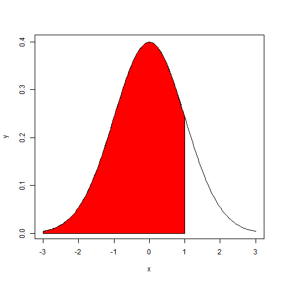

\begingroup
\titleformat{\chapter}[display]
{\normalfont\huge\bfseries\centering}{\chaptertitlename\ \thechapter}{20pt}{\Huge}
# Modelação Estatística na Otimização de Portfólios
\newpage

```{r, include=FALSE}
knitr::opts_chunk$set(tidy=FALSE, message = FALSE,warning =  FALSE,fig.align = "center",fig.show = "hold")
```

## Series Temporais

O valor da cotação de activos financeiros, como acções ou opções, são representados de forma sequencial ao longo do tempo, considerando determinado intervalo, que pode ser segundos, minutos, dias, semanas ou outro intervalo considerado útil para representação dos dados ao longo do tempo. Quando tal acontece estamos em presença de series temporais.

Os preços de activos financeiros ao longo do tempo formam o que é denominado por processos estocásticos. Processos estocásticos são uma classe de series temporais onde o valor da variável muda ao longo de tempo de forma aleatória. Os processo estocásticos podem ser classificados de discretos ou contínuos, sendo que na análise de activos financeiros, embora estes sigam processos discretos, serão considerados processos estocásticos contínuos ao longo do tempo, sendo que estes modelos acabam por ser bastante úteis na modelização dos preços de activos financeiros de acordo com @Hull2018.

### Modelação do preço de acções

Os preços das acções seguem habitualmente o que é conhecido por um processo de Markov, onde apenas o valor presente importa para prever o valor futuro. Desta forma a única informação relevante é o seu valor no momento, sendo que os valores e trajecto verificado no passado não irão ter importância na definição da distribuição probabilística do preço no futuro [@Hull2018].Desta forma as propriedades de Markov no preço das acções é consistente com a eficiência dos mercados na forma fraca, constituindo esta uma das três formas de eficiência de mercado definidas por Eugene Fama^[Ver "https://pt.wikipedia.org/wiki/Eugene_Fama"].

O modelo representado aqui e que será utilizado para simular preços de activos financeiros atravessou vários pressupostos até a sua conclusão final, sendo apresentado de uma forma muito sucinta as principais etapas de desenvolvimento desse modelo.

Um dos primeiros modelos era representado por um processo de Wiener, sendo este um processo particular do processo estocástico Markov, referido como movimento Browniano, descrevendo a evolução de uma variável com distribuição normal padrão. A modelação pressupõe que a variável z possa ser dada pela seguinte equação:

\begin{equation} 
  dz = \varepsilon \sqrt{dt}\qquad   \varepsilon \sim N(0,1);
  (\#eq:wiener)
\end{equation} 

Desta forma a variável z segue um processo de Wiener, sendo uma variável independente e identicamente distribuída (i.i.d). 

Como este modelo não preenchia todos os pressupostos, aplicou-se um processo generalizado de Wiener (também conhecido como movimento Browniano (BM)), onde é incluindo um amplificador/redutor na parte aleatória do processo de forma a ajustar o processo a propriedades especificas de cada acção, ilustrado na equação \@ref(eq:gwiener). Este processo descreve a evolução de um processo de uma variável com distribuição normal, com um desvio $\mu$ por unidade de tempo e uma taxa de variância de $\sigma^2$ também por unidade de tempo. 
 
\begin{equation} 
  \delta S = \mu\delta t +\sigma\varepsilon\sqrt{\delta t}\qquad\varepsilon \sim N(0,1);
  (\#eq:gwiener)
\end{equation} 

A diferença relativo a um processo de Wiener é que no processo generalizado de Wiener a taxa de desvio e variância pode ter como valor qualquer constante, sendo que no processo de Wiener esses valores são de 0 e 1 respectivamente.

Outro processo estocástico, conhecido como processo Itô, foi desenvolvido, representando um processo generalizado de Wiener, sendo que neste caso o valor dos parâmetros $\mu$ e $\sigma$ são funções do valor subjacente da variável S e do tempo t. Este modelo é o que vai ser utilizado para simulação do preço das acções sendo representado pelas seguintes equações:

\begin{equation} 
  \frac{\delta S}{S} = \mu\delta t +\sigma\varepsilon\sqrt{\delta t}\qquad\varepsilon \sim N(0,1);
  (\#eq:ito)
\end{equation} 
\begin{equation} 
  In S_1 - InS_0 \approx\phi\Big[\Big(\mu-\frac{\sigma^2}{2}\Big)\delta t, \sigma\sqrt{\delta t}\Big]
  (\#eq:Inito)
\end{equation} 
\begin{equation} 
  S_1 =S_0 e^{\Big(\mu-\frac{\sigma^2}{2}\Big)\delta t + \sigma\varepsilon\sqrt{\delta t}}
  (\#eq:logprice)
\end{equation} 

Nesta equação o $\mu$ representa a taxa de retorno anual esperado, sendo que $\sigma$ representa o desvio padrão ou volatilidade da acção, parâmetro muito importante para a determinação do valor de vários derivados, havendo várias formas de calcular este valor como veremos mais adiante. Estes valores são função do corrente valor de S e do tempo actual t. Numa economia neutra face ao risco $\mu$ é igual a taxa de juro sem risco. O $\varepsilon$ representa uma variável com distribuição normal(N(0,1)). 

Este processo é conhecido como movimento Browniano geométrico (GBM). De acordo com @AppliedFinancial um "GBM pode ser considerado como um movimento probabilístico contínuo no qual o logaritmo da quantidade que varia aleatoriamente segue um movimento Browniano (processo de Wiener) com desvio." Este modelo é a base do modelo de Black-Scholes, que será revisto mais adiante, aquando do cálculo da volatilidade implícita nas opções.

Tendo em consideração a equação \@ref(eq:logprice), S segue uma distribuição lognormal. Uma distribuição lognormal é mais realístico de acordo com o movimento do preço das acções, prevenindo que o valor se torne negativo.

Em simulação, este processo é realizado considerando uma distribuição normal com média e variância dada pela equação \@ref(eq:Inito) [@FRM1].

### Simulação de Monte Carlo

A simulação de Monte Carlo consiste na geração de valores a partir de uma determinada distribuição ou amostra, sendo que "o termo Monte Carlo é usado para se referir a técnicas que envolvem simulação computacional"[@ProgSim,pp.457]. 

Ao simular os preços dos activos financeiros iremos utilizar a técnica de Monte Carlo de modo a gerar amostras aleatórias de acordo com a equação \@ref(eq:logprice). Os preços serão simulados criando várias tentativas com valores aleatórios para $\varepsilon$ a partir de $\phi$(0,1). A precisão dos valores obtidos na simulação depende do número de tentativas efectuadas, sendo considerado 1000 tentativas por cada dia e considerar o valor médio dessas tentativas como o valor simulado para cada um dos dias simulados.

## Volatilidade

### Média Móvel Exponencial (EWMA)

A média móvel exponencial, referida a partir de agora como EWMA, é um método de calculo da variância, sendo um método que utiliza os dados históricos associando mais peso aos retornos mais recentes no calculo da variância.

### Heteroscedasticidade condicional auto-regressiva generalizada (GARCH)

### Volatilidade implícita

O modelo de Black-Scholes-Merton^[Os autores, Robert Merton e Myron Scholes, foram reconhecidos com o Nobel da economia em 1997] foi um modelo desenvolvido nos anos 70, considerado um ponto de ruptura na definição do preço de opções sobre acções europeias. 

De entre os pressupostos^[Para mais informação ver @BlackScholes,pp. 640, capitulo "The valuation formula"] utilizados para derivar a equação diferencial, importa salientar de que a taxa de juro sem risco, r, é constante e a mesma ao longo do tempo. De acordo com @Hull2018 "É importante considerar que a avaliação sem risco (ou o pressuposto de que todos os investidores são neutros ao risco) é meramente um artifício para obter solução para a equação diferencial de Black-Scholes-Merton"(p.312).

O processo que se assume ser aplicado ao preço dos activos é o descrito pela equação \@ref(eq:ito). De salientar de que nenhumas das variáveis da equação é afectada pelas preferências de risco dos investidores, sendo que as variáveis que aparecem na equação são o valor presente do activo financeiro, tempo, volatilidade e a taxa de juro sem risco. 

As soluções obtidas a partir da equação diferenciável de interesse para calculo da volatilidade implícita, são as aqui apresentadas para valorizar opções de compra (*call*) e opções de venda (*put*) do tipo europeias:

\begin{equation} 
  c = S_0N(d_1) - Ke^{-rT}N(d_2);
  (\#eq:call)
\end{equation} 
e
\begin{equation} 
  p = Ke^{-rT}N(-d_2) - S_0N(-d_1);
  (\#eq:put)
\end{equation} 
onde
\begin{equation} 
  d_1 = \frac{In(S_0/K)+(r+\sigma^2/2)T}{\sigma\sqrt{T}}
  (\#eq:d1)
\end{equation}
\begin{equation} 
  d_2 = \frac{In(S_0/K)+(r-\sigma^2/2)T}{\sigma\sqrt{T}}=d_1-\sigma\sqrt{T}
  (\#eq:d2)
\end{equation}

A função N(x) representa a função distribuição para uma distribuição normal padrão, sendo a probabilidade de uma variável ser menor que x (ver exemplo na figura \@ref(fig:fdistribuicao)). O valor de N(x) pode ser obtido com a função do R pnorm(). A variável T representa o tempo medido em dias de negociação que faltam até a expiração da opção dividido pelos dias de negociação nesse ano, sendo S~0~ o valor do activo subjacente no tempo 0, r a taxa de juro sem risco, $\sigma$ a volatilidade anual e K o preço de exercício da opção.
```{r, fdistribuicao,echo=FALSE,fig.cap='Função distribuição N(x)',out.width="45%"}

```
\centering 
Fonte: Elaboração própria.

\justifying
\bigskip

O parâmetro da volatilidade não é um parâmetro que se consiga obter ou observar directamente, sendo um valor que representa a volatilidade esperada pelos investidores no futuro, conhecido como **volatilidade implícita**. Um modo de obter este valor é a partir dos restantes parâmetros, ou seja, tendo o valor de uma opção de compra, e considerando os valores de S~0~, K, r e T, substituir estes pelos respectivos valores e obter o valor de $\sigma$ que iguale o valor da *call* utilizando as equações \@ref(eq:call) e \@ref(eq:d1) através de processos por aproximação iterativo. 

A volatilidade implícita será diferente consoante o preço de exercício da opção, considerando todos os outros parâmetros iguais. Da conjugação dos valore de volatilidade obtidos para cada um dos preços de exercício da opção obtêm-se um gráfico conhecido como *volatility smile*(figura \@ref(fig:volatilitysmile)). Este gráfico será o mesmo, quer se esteja a considerar uma opção do tipo *call* ou a mesma equivalente opção do tipo *put*.

\bigskip
```{r, volatilitysmile,echo=FALSE,fig.cap='Volatility Smile',out.width = "60%"}

```
\centering 
Fonte: [@volatilitysmile, pp.182]

\justifying
\bigskip

Como de pode ver pela figura \@ref(fig:volatilitysmile) a opção é considerada *out-the-money* se o seu valor for inferior ao do respectivo subjacente, *at-the-money* se for superior e *in-the-money* se o valor for igual. No calculo do valor da volatilidade será utilizado o valor de preço de exercício *in-the-money* de opções do tipo *call*, ou na impossibilidade do valor do subjacente ser o mesmo do K, o mais próximo deste.

Quando comparado com outros métodos para calcular a volatilidade onde os dados utilizados são dados históricos, este método incorpora o sentimento presente dos investidores relativo a volatilidade futura de um determinado ativo ou instrumento financeiro.

## Portfolios média-variância

A otimização de portfolios através da diversificação é um conceito básico que teve origem em Markowitz, criando o conceito de fronteira eficiente. Existem vários pressupostos definidos na obtenção deste modelo, não sendo, no entanto, o âmbito aqui analisar esses mesmos pressupostos, considerando que independentemente disso esses mesmos pressupostos são verificados. De acordo com @Modern2013, “todas os pressupostos acerca da analise de portfolio foram demonstradas serem simplistas, e em alguns casos demasiado simplistas.[...]Pessoas necessitam apenas de se comportar como se fossem descritas pelos pressupostos para uma teoria ser válida” [@Modern2013,pp.5]. 

Para aplicação deste modelo deve-se obter os seguintes dados dos instrumentos financeiros que vão constituir o portfolio:

- A taxa do retorno esperado, E(r);
- O desvio padrão dos retornos, $\sigma$;
- O coeficiente de correlação,$\rho$, entre cada um dos activos.

O retorno esperado vai depender de vários factores, essencialmente a taxa de retorno sem risco que se verifica no mercado, a taxa de inflação e o risco a que o investidor estará sujeito, sendo que quanto maior o risco, maior será o retorno esperado.
As séries dos retornos diários para cada um dos activos é calculada de acordo com a seguinte formula:

\begin{equation} 
  R_i = ln\Big(\frac{V_f}{V_i}\Big)
  (\#eq:logRet)
\end{equation} 

A média dos retornos de cada um dos activos é calculada de acordo com a sua média aritmética:

\begin{equation} 
  \overline{R} = \frac{\displaystyle\sum_{i=1}^n R_i}{n}
  (\#eq:meanRet)
\end{equation}  

O desvio padrão representa a volatilidade, ou risco, associada ao activo. Considerando que essa volatilidade é calculada com base nos dados históricos e as formulas acima, então a estatística da amostra para o desvio padrão representa-se pela seguinte formulas:

\begin{equation} 
  \hat{\sigma} = \sqrt\frac{\displaystyle\sum_{i=1}^n (R_i-\overline{R})^2}{n-1}
  (\#eq:estdesviopadrao)
\end{equation} 

A escolha do tamanho da amostra (n) deve ser grande o suficiente de modo a garantir uma melhor precisão nas estatísticas obtidas, sendo que neste caso devemos considerar que a volatilidade não é constante ao longo do tempo e que valores mais antigos podem não ser tão relevantes como os valores mais recentes. De acordo com [@Hull2018] esse valor deve ser compreendido entre 90 a 180 dias para a cotação de activos. 

Para o calculo da volatilidade anual utiliza-se os número de dias de negociação, sendo considerado 252 dias por ano como valor de referência.

## Value at Risk

A quantificação do risco é fundamental para a gestão e atenuação de perdas no valor da carteira ao longo do tempo. Na gestão da carteira a aplicação de métricas de risco permite a adaptação contínua do portfólio aos fatores de risco quantificáveis, podendo-se, através de uma gestão ativa, manter o investidor devidamente informado relativamente ao risco que o seu investimento incorpora e poder tomar medidas proactivas de adaptação do investimento ao nível de risco verificado, tendo em consideração o perfil do investidor.O Value at Risk (VaR) é uma dessas métricas de risco.

O Value at Risk (VaR)^[Markowitz foi dos primeiros autores a contemplar a análise de risco em investimentos, como se pode verificar em @Markowitz1952] é uma medida probabilística para a perda máxima provável de uma carteira para um nível de confiança determinado,num horizonte temporal especificado. Pode-se definir o VaR como "descrevendo o quantil da distribuição de ganhos e perdas projectado ao longo do horizonte alvo. Se *c* for o intervalo de confiança selecionado, VaR corresponde ao nível inferior da cauda 1-*c* "[@philippe,pp.17]. Este valor é sempre positivo.

O calculo do valor do VaR é de carácter obrigatório para entidades financeiras e seguradoras, sendo que os reguladores, dependendo da sua jurisdição, determinam os parâmetros quantitativos a serem utilizados.
No caso do Banco Central Europeu^[ver relatório técnico @ecb], esses parâmetros são de que o cálculo deve ser efectuado para um intervalo temporal de 10 dias de negociação e para um intervalo de confiança de 99%, sendo considerado para esses cálculos pelo menos 250 dias negociação de observação de valores históricos.

O cálculo do VaR pode ser realizado de modos diferentes, existindo vários métodos, sendo considerados métodos de tipo não paramétrico, como o método histórico em que não se assume nenhum pressuposto na distribuição desses dados, ou métodos do tipo paramétrico, onde se assume um determinado tipo de distribuição dos dados. Para efeito desta tese será utilizado um método paramétrico para cálculo do VaR, sendo apresentado seguidamente.

### VaR paramétrico (Gaussiana)

O VaR paramétrico pressupõe que os retornos diários apresentem uma distribuição normal (figura \@ref(fig:var)), sendo que a sua representação matemática se encontra definida na equação \@ref(eq:var).


(ref:var) VaR com intervalo confiança 95% e 99%. 
```{r, var, echo=FALSE, fig.cap="(ref:var)", out.width="60%"}
knitr::include_graphics("image/VaR.png")
```
\FloatBarrier

\centering 
Fonte: [@phdthesis, pp.13]

\justifying
\bigskip

\begin{equation} 
  VaR_{t+1}^{z} = -\sigma_{t+1}\Phi_{z}^{-1}
  (\#eq:var)
\end{equation} 

O $\Phi (z)$ representa a função distribuição sendo $\Phi^{-1} (z)$ a sua inversa, sendo que, por exemplo para um intervalo de confiança de 99% o valor de $\Phi^{-1} (z)$ corresponde a -2.33. Se considerarmos que a volatilidade prevista a 1 dia é de 2%, teremos um VaR = -0.020*(-2.33), o que corresponde a um valor de 0.0466. Podemos interpretar o VaR como sendo a existência de 1% de probabilidade de perder mais do que 4.66% do valor investido no activo no dia de hoje. 

### VaR paramétrico (Aproximação Cornish-Fisher)

sendo que caso a distribuição dos dados não sejam a de uma distribuição normal se pode proceder à aproximação Cornish-Fisher para considerar o excesso de *Kurtosis* e a respectiva assimetria (*Skewness*).
