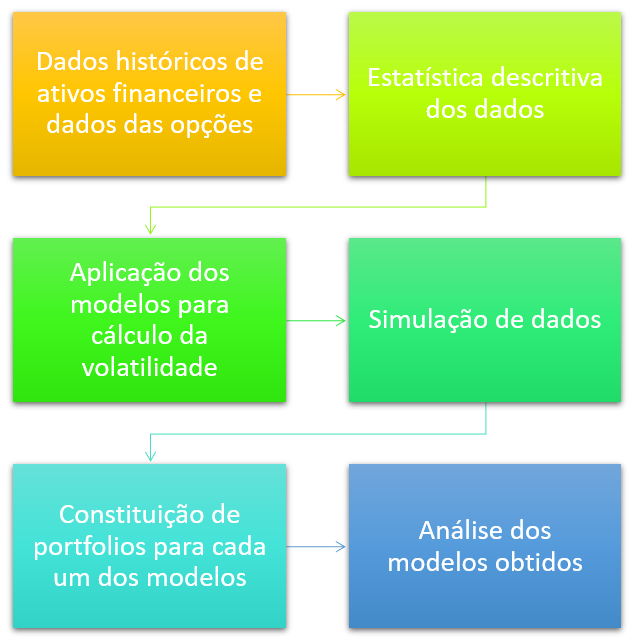
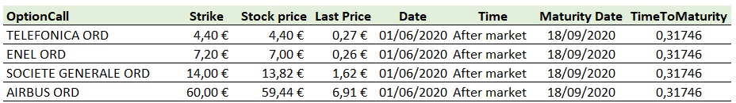

# Aplicação a dados do modelo
\endgroup
\newpage

## Introdução
```{r,include=FALSE}
Sys.setlocale("LC_ALL","English")
rm(list = ls())
knitr::opts_chunk$set(tidy=FALSE, message = FALSE,warning =  FALSE,fig.align = "center",fig.show = "hold")
#install.packages("https://cran.r-project.org/src/contrib/Archive/fGarch/fGarch_3042.83.1.tar.gz", #repo=NULL, type="source")
#install.packages("kableExtra")
#install.packages("tidyquant")
#install.packages("MASS")
#install.packages("arsenal")
#install.packages("formatR")
#install.packages("ggfortify")
#install.packages("MFTSR", repos="http://R-Forge.R-project.org")
#install.packages("Metrics")
#install.packages("stats")
#install.packages("portes")
#install.packages("reshape2")
#install.packages("Quandl")
library(readxl)
library(Quandl)
library(reshape2)
library(portes)
library(stats)
library(forecast)
library(Metrics)
library(fGarch)
library(MFTSR)
library(ggfortify)
library(tidyquant)
library(arsenal)
library(MASS)
library(kableExtra)
library(xlsx)
library(tidyverse)
library(RQuantLib)
library(tseries)
library(timeSeries)
library(fPortfolio)
library(caTools)
library(dygraphs)
library(portfolio.optimization)
library(rugarch)
```


```{r, processo,echo=FALSE,fig.cap='Modelação do processo',out.width="80%"}

```
\FloatBarrier
\centering 
Fonte: Elaboração própria.


## Análise descritiva dos dados
A primeira fase consiste em extrair de forma aleatória 4 acções constituintes do Euro Stoxx 50, estando os valores obtidos representados na figura \@ref(fig:empresas).

```{r, empresas,echo=FALSE,fig.cap='Empresas extraidas do Euro Stoxx 50',out.width="100%"}
knitr::include_graphics("image/cotacao.png")
```
\FloatBarrier
\centering 
Fonte: Elaboração própria.

\justifying
\bigskip

```{r,echo=FALSE}
TEF.MC<-read_xlsx ("data/TEF.MC.xlsx")
TEF.MC <- xts(TEF.MC[, -1], order.by=as.Date(TEF.MC$Date))
GLE.PA<-read_xlsx ("data/GLE.PA.xlsx")
GLE.PA <- xts(GLE.PA[, -1], order.by=as.Date(GLE.PA$Date))
ENEL.MI<-read_xlsx ("data/ENEL.MI.xlsx")
ENEL.MI <- xts(ENEL.MI[, -1], order.by=as.Date(ENEL.MI$Date))
AIR.PA<-read_xlsx ("data/AIR.PA.xlsx")
AIR.PA <- xts(AIR.PA[, -1], order.by=as.Date(AIR.PA$Date))
```


```{r,echo=FALSE}
gle<-tail(GLE.PA)
gle <- knitr::kable(
  gle, caption = "Société Générale.Euronext Paris-25-05-2020/01-06-2020",
  booktabs = TRUE)
kable_styling(gle, latex_options = "hold_position", position = "center")
```
\FloatBarrier
\centering 
Fonte:https://finance.yahoo.com/

\justifying
\bigskip

```{r,echo=FALSE, cotacao, fig.cap='Evolução das cotações nos últimos 5 anos',fig.topcaption = TRUE,out.width = "45%"}
par(mfrow  = c(2,2))
chartSeries(TEF.MC,theme = chartTheme("white",up.col="darkgreen"))
chartSeries(ENEL.MI,theme = chartTheme("white",up.col="dodgerblue3"))
chartSeries(GLE.PA,theme = chartTheme("white",up.col="darkorange"))
chartSeries(AIR.PA,theme = chartTheme("white",up.col="deeppink"))
```

\FloatBarrier
\centering 
Fonte: Elaboração própria.

\justifying
\bigskip

```{r,echo=FALSE}
newdata <- merge(TEF.MC$`Adj Close`,ENEL.MI$`Adj Close`,GLE.PA$`Adj Close`,AIR.PA$`Adj Close`)
newdata <- na.omit(newdata)
colnames(newdata) <- c("TEF.MC","ENEL.MI","GLE.PA","AIR.PA")
adj <- tail(newdata)
adj <- knitr::kable(
  adj, caption = "Cotações a preços ajustados-25-05-2020/01-06-2020",
  booktabs = TRUE)
kable_styling(adj, latex_options = "hold_position", position = "center")
```
\FloatBarrier
\centering 
Fonte:https://finance.yahoo.com/

\justifying
\bigskip
\scriptsize
```{r}
pt <-summary(as.data.frame(newdata))
p <- knitr::kable(
  pt, caption = "Estatísticas das cotações",
  booktabs = TRUE)
kable_styling(p, latex_options = "hold_position", position = "center")
```
\normalsize
\FloatBarrier
\centering 
Fonte:Elaboração própria.

\justifying
\bigskip
\scriptsize
```{r}
returns <- as.xts(data.frame(round(dailyReturn(newdata$TEF.MC,type="log"),4),
                             round(dailyReturn(newdata$ENEL.MI,type="log"),4),
                             round(dailyReturn(newdata$GLE.PA,type="log"),4),
                             round(dailyReturn(newdata$AIR.PA,type="log"),4)))
returns <- returns[-1,]
```
\normalsize

```{r,echo=FALSE}
colnames(returns)<-c("TEF.RET","ENEL.RET","GLE.RET","AIR.RET")
ret <- tail(returns)
retv <- knitr::kable(
  ret, caption = "Retornos logarítmicos diários-25-05-2020/01-06-2020",
  booktabs = TRUE)
kable_styling(retv, latex_options = "hold_position", position = "center")
```
\FloatBarrier
\centering 
Fonte:Elaboração própria.

\justifying
\bigskip
\scriptsize
```{r}
retcor <- cor(returns)
```
\normalsize

```{r, echo=FALSE}
retcork <- knitr::kable(
  retcor, caption = "Matrix correlação dos retornos",
  booktabs = TRUE)
kable_styling(retcork , latex_options = "hold_position", position = "center")
```
\FloatBarrier
\centering 
Fonte:Elaboração própria.

\justifying
\bigskip
\scriptsize
```{r}
retannual <- function(x) {  
  Return.annualized(x,geometric = FALSE)}
retvol <- function(x) {  
  StdDev.annualized(x,geometric = FALSE)}

ETFStats <- do.call(data.frame, 
                    list("média anual"= round(apply(returns, 2,retannual),6),
                         "volatilidade anual"= round(apply(returns, 2, retvol),6),
                         mediana = round(apply(returns, 2, median),6),
                         skewness = round(apply(returns, 2, skewness),6),
                         kurtosis = round(apply(returns, 2, kurtosis),6),
                         min = round(apply(returns, 2, min),6),
                         max = round(apply(returns, 2, max),6)))
```
nolmalsize

```{r, echo=FALSE}
ETFStats<-t(ETFStats)
ETFStatsk<- knitr::kable(
  ETFStats, caption = "Estatísticas dos retornos",
  booktabs = TRUE)
kable_styling(ETFStatsk , latex_options = "hold_position", position = "center")
```
\FloatBarrier
\centering 
Fonte:Elaboração própria.

\justifying
\bigskip
```{r,volatilidade,echo=FALSE, fig.cap='Volatilidade nos últimos 4 anos',fig.topcaption = TRUE,out.width = "45%"}
par(mfrow  = c(2,2))
autoplot(returns$TEF.RET,ts.colour = 'darkgreen') + ggtitle("TELEFÓNICA") + 
  ylab("Log return") + xlab("anos") + theme(plot.title = element_text(hjust = 0.5))
autoplot(returns$ENEL.RET,ts.colour = 'dodgerblue3') + ggtitle("ENEL") + 
  ylab("Log return") + xlab("anos") + theme(plot.title = element_text(hjust = 0.5))
autoplot(returns$GLE.RET,ts.colour = 'darkorange') + ggtitle("SOCIÉTÉ GÉNÉRALE") + 
  ylab("Log return") + xlab("anos") + theme(plot.title = element_text(hjust = 0.5))
autoplot(returns$AIR.RET,ts.colour = 'deeppink') + ggtitle("AIRBUS") + 
  ylab("Log return") + xlab("anos") + theme(plot.title = element_text(hjust = 0.5))
```
\FloatBarrier
\centering 
Fonte:Elaboração própria.

\justifying
\bigskip
```{r,distr,echo=FALSE, fig.cap='Distribuição dos retornos',fig.topcaption = TRUE,out.width = "100%"}
par(mfrow  = c(2,2))
hist(returns$TEF.RET,probability=T, main="TELEFÓNICA",xlab="",breaks=100)
lines(density(returns$TEF.RET),col=2)
curve(dnorm(x,0,0.01695272), from = -0.15,to=0.15, col='blue',add = TRUE)
hist(returns$ENEL.RET,probability=T, main="ENEL",xlab="",breaks=100)
lines(density(returns$ENEL.RET),col=2)
curve(dnorm(x,0,0.01571777), from = -0.05,to=0.05, col='blue',add = TRUE)
hist(returns$GLE.RET,probability=T, main="SOCIÉTÉ GÉNÉRALE",xlab="",breaks=100)
lines(density(returns$GLE.RET),col=2)
curve(dnorm(x,0,0.02557792), from = -0.1,to=0.1, col='blue',add = TRUE)
hist(returns$AIR.RET,probability=T, main="AIRBUS",xlab="",breaks=100)
lines(density(returns$AIR.RET),col=2)
curve(dnorm(x,0,0.02397011), from = -0.1,to=0.1, col='blue',add = TRUE)
```
\FloatBarrier
\centering 
Fonte:Elaboração própria.

\justifying
\bigskip
```{r,teste,echo=FALSE, fig.cap='Teste a normalidade das distribuições',fig.topcaption = TRUE,out.width = "100%"}
par(mfrow  = c(2,2))
qqnorm(returns$TEF.RET,main="TELEFÓNICA",pch=14,col='darkgreen')
qqline(returns$TEF.RET)
qqnorm(returns$ENEL.RET,main="ENEL",pch=14,col = 'dodgerblue3')
qqline(returns$ENEL.RET)
qqnorm(returns$GLE.RET,main="SOCIÉTÉ GÉNÉRALE",pch=14,col = "darkorange")
qqline(returns$GLE.RET)
qqnorm(returns$AIR.RET,main="AIRBUS",pch=14,col ="deeppink")
qqline(returns$AIR.RET)
```
\FloatBarrier
\centering 
Fonte:Elaboração própria.

\justifying
\bigskip
\scriptsize
```{r}
lshap<- lapply(as.data.frame(returns), shapiro.test)
lres <- sapply(lshap, "[", c("statistic","p.value"))
```
\normalsize

```{r,echo=FALSE}
lresk<- knitr::kable(
  lres, caption = "Teste normalidade Shapiro-Wilk",
  booktabs = TRUE)
kable_styling(lresk , latex_options = c("hold_position","scale_down"), position = "center")
```
\FloatBarrier
\centering 
Fonte:Elaboração própria.

\justifying
\bigskip

## EWMA
\scriptsize
```{r}
ewma <- function(x) {  
  x<-ewmaVol(x,lambda = 0.94)
  return(head(x$sigma,1))
}

pewma <- do.call(data.frame, 
                 list("ewma"= round(apply(returns, 2,ewma),6)))
```
\normalsize

```{r,echo=FALSE}
pewma<-t(pewma)
pewmak<- knitr::kable(
  pewma, caption = "EWMA",
  booktabs = TRUE)
kable_styling(pewmak , latex_options = "hold_position", position = "center")
```
\FloatBarrier
\centering 
Fonte:Elaboração própria.

\justifying
\bigskip

```{r,TELp,echo=FALSE, fig.cap='EWMA',fig.topcaption = TRUE,out.width = "90%"}
TEFew <- ewmaVol(returns$TEF.RET,lambda = 0.94)
ENELew <- ewmaVol(returns$ENEL.RET,lambda = 0.94)
GLEew <- ewmaVol(returns$GLE.RET,lambda = 0.94)
AIRew <- ewmaVol(returns$AIR.RET,lambda = 0.94)

par(mfrow  = c(2,2))
TEL1<-plot(returns$TEF.RET,type="l",main="Telefónica", col="green")
lines(TEFew$sigma,col="darkgreen")
TEL3<-plot(returns$ENEL.RET,type="l",main="ENEL",col="green")
lines(ENELew$sigma,col="dodgerblue3")
TEL5<-plot(returns$GLE.RET,type="l",main="SoGen",col="green")
lines(GLEew$sigma,col="darkorange")
TEL7<-plot(returns$AIR.RET,type="l",main="Airbus",col="green")
lines(AIRew$sigma,col="deeppink")

```
\FloatBarrier
\centering 
Fonte:Elaboração própria.

\justifying
\bigskip

### Simulação EWMA

\scriptsize
```{r}
dfewma <- as.data.frame(pewma)

N <- 80
dia <- 1:N
M <- 1000
mu <- -0.00575
```
\normalsize

\scriptsize
```{r,warning=FALSE}
TEF.preco_inicial <- TEF.MC$Close[[nrow(TEF.MC$Close)]]
TEF.MC.sigma <- dfewma$TEF.RET*sqrt(252)
TEF.MC.mean <- (mu-(TEF.MC.sigma^2)/2)*(1/252)

set.seed(1)
monte_carlo_sim <- matrix(nrow=N, ncol = M)
for(j in 1:M){
  monte_carlo_sim[[1,j]] <- TEF.preco_inicial
  for(i in 2:N){
    monte_carlo_sim[[i,j]] <- monte_carlo_sim[[i-1,j]]*
      exp(TEF.MC.mean+TEF.MC.sigma *
            rnorm(1,0,1)*sqrt(1/252))
  }
}

TEF.MC_MC_sim <- as_tibble(cbind(dia,monte_carlo_sim))
w <- str_c('Sim',seq(1,M))
w <- c('Dia',w)
names(TEF.MC_MC_sim) <- w
TEF.MC_MC_sim <- gather(TEF.MC_MC_sim, key='Simulation', value = 'Preço',-(Dia))
```
\normalsize

```{r,echo=FALSE, warning=FALSE}
ENEL.preco_inicial <- ENEL.MI$Close[[nrow(ENEL.MI$Close)]]
ENEL.MI.sigma <- dfewma$ENEL.RET*sqrt(252)
ENEL.MI.mean <- (mu-(ENEL.MI.sigma^2)/2)*(1/252)

set.seed(2)
ENEL_monte_carlo_sim <- matrix(nrow=N, ncol = M)
for(j in 1:M){
  ENEL_monte_carlo_sim[[1,j]] <- ENEL.preco_inicial
  for(i in 2:N){
    ENEL_monte_carlo_sim[[i,j]] <- ENEL_monte_carlo_sim[[i-1,j]]*exp(ENEL.MI.mean+ENEL.MI.sigma * rnorm(1,0,1)*sqrt(1/252))
  }
}
ENEL.MI_MC_sim <- as_tibble(cbind(dia,ENEL_monte_carlo_sim))
w1 <- str_c('Sim',seq(1,M))
w1 <- c('Dia',w1)
names(ENEL.MI_MC_sim) <- w1
ENEL.MI_MC_sim <- gather(ENEL.MI_MC_sim, key='Simulation', value = 'Preço',-(Dia))
```

```{r,echo=FALSE, warning=FALSE}
GLE.preco_inicial <- GLE.PA$Close[[nrow(GLE.PA$Close)]]
GLE.PA.sigma <- dfewma$GLE.RET*sqrt(252)
GLE.PA.mean <- (mu-(GLE.PA.sigma^2)/2)*(1/252)

set.seed(3)
GLE_monte_carlo_sim <- matrix(nrow=N, ncol = M)
for(j in 1:M){
  GLE_monte_carlo_sim[[1,j]] <- GLE.preco_inicial
  for(i in 2:N){
    GLE_monte_carlo_sim[[i,j]] <- GLE_monte_carlo_sim[[i-1,j]]*exp(GLE.PA.mean+GLE.PA.sigma * rnorm(1,0,1)*sqrt(1/252))
  }
}
GLE.PA_MC_sim <- as_tibble(cbind(dia,GLE_monte_carlo_sim))
w2 <- str_c('Sim',seq(1,M))
w2 <- c('Dia',w2)
names(GLE.PA_MC_sim) <- w2
GLE.PA_MC_sim <- gather(GLE.PA_MC_sim, key='Simulation', value = 'Preço',-(Dia))
```

```{r,echo=FALSE, warning=FALSE}
AIR.preco_inicial <- AIR.PA$Close[[nrow(AIR.PA$Close)]]
AIR.PA.sigma <- dfewma$AIR.RET*sqrt(252)
AIR.PA.mean <- (mu-(AIR.PA.sigma^2)/2)*(1/252)

set.seed(4)
AIR_monte_carlo_sim <- matrix(nrow=N, ncol = M)
for(j in 1:M){
  AIR_monte_carlo_sim[[1,j]] <- AIR.preco_inicial
  for(i in 2:N){
    AIR_monte_carlo_sim[[i,j]] <- AIR_monte_carlo_sim[[i-1,j]]*exp(AIR.PA.mean+AIR.PA.sigma * rnorm(1,0,1)*sqrt(1/252))
  }
}
AIR.PA_MC_sim <- as_tibble(cbind(dia,AIR_monte_carlo_sim))
w3 <- str_c('Sim',seq(1,M))
w3 <- c('Dia',w3)
names(AIR.PA_MC_sim) <- w3
AIR.PA_MC_sim <- gather(AIR.PA_MC_sim, key='Simulation', value = 'Preço',-(Dia))
```


```{r,sim,echo=FALSE, fig.cap='Simulação Monte Carlo para 80 dias',fig.topcaption = TRUE,out.width = "45%"}

par(mfrow  = c(2,2))
ggplot(TEF.MC_MC_sim,aes(x = Dia, y = Preço, Group = Simulation)) + geom_line(alpha = 0.1,colour = 'darkgreen'
) + ggtitle(str_c("TEF: ", M, " Simulações de Monte Carlo ao longo de ", N," dias negociação"))
ggplot(ENEL.MI_MC_sim,aes(x = Dia, y = Preço, Group = Simulation)) + geom_line(alpha = 0.1,colour = 'dodgerblue3') + ggtitle(str_c("ENEL: ", M, " Simulações de Monte Carlo ao longo de ", N," dias negociação"))
ggplot(GLE.PA_MC_sim,aes(x = Dia, y = Preço, Group = Simulation)) + geom_line(alpha = 0.1,colour = "darkorange"
) + ggtitle(str_c("GLE: ", M, " Simulações de Monte Carlo ao longo de ", N," dias negociação"))
ggplot(AIR.PA_MC_sim,aes(x = Dia, y = Preço, Group = Simulation)) + geom_line(alpha = 0.1,colour="deeppink") + ggtitle(str_c("AIR: ", M, " Simulações de Monte Carlo ao longo de ", N," dias negociação"))
```

\scriptsize
```{r}
M.TEF.MC <- apply(monte_carlo_sim, 1, median)
M.ENEL.MI <- apply(ENEL_monte_carlo_sim, 1,median )
M.GLE.PA <- apply(GLE_monte_carlo_sim, 1,median )
M.AIR.PA <- apply(AIR_monte_carlo_sim, 1,median )
```

\normalsize
```{r,echo=FALSE}
SimEWMA <- as.data.frame(cbind(M.TEF.MC,M.ENEL.MI,M.GLE.PA,M.AIR.PA))
SimEWMAk<- knitr::kable(
  tail(SimEWMA), caption = "Valores simulados",
  booktabs = TRUE)
kable_styling(SimEWMAk , latex_options = "hold_position", position = "center")
```
\FloatBarrier
\centering 
Fonte:Elaboração própria.

\justifying
\bigskip
### Portfolio EWMA

```{r,echo=FALSE}
SimDate<-read_xlsx ("data/date.xlsx")
SDate<- as.Date(SimDate$Date)
SimTEF <- as.numeric(SimEWMA$M.TEF.MC)
SimTEF.MC <-xts(SimTEF,SDate)
SimENEL <- as.numeric(SimEWMA$M.ENEL.MI)
SimENEL.MI <-xts(SimENEL,SDate)
SimGLE <- as.numeric(SimEWMA$M.GLE.PA)
SimGLE.PA <-xts(SimGLE,SDate)
SimAIR <- as.numeric(SimEWMA$M.AIR.PA)
SimAIR.PA <-xts(SimAIR,SDate)

myPortfolio <-na.omit(merge(SimTEF.MC,SimENEL.MI,SimGLE.PA,SimAIR.PA))

myPortfolioReturns <- ROC(myPortfolio,type="discrete")[-1,]
colnames(myPortfolioReturns) <- c("SimTEF","SimENEL","SimGLE","SimAIR")
```


\scriptsize
```{r}
set.seed(10)
SimReturns <- as.timeSeries(myPortfolioReturns)
#returns the portfolio with the minimal risk on the efficient frontier
minvarewma <- minvariancePortfolio(SimReturns) 
minew<-getPortfolio(minvarewma)
```
\normalsize

```{r,echo=FALSE}
minewma<- as.data.frame(minew$weights)
colnames(minewma)<- c("Pesos")
minewmak<- knitr::kable(
  minewma, caption = "Pesos no portfolio",
  booktabs = TRUE)
kable_styling(minewmak , latex_options = "hold_position", position = "center")
```

\scriptsize
```{r}
optweights <- c(0.2939002, 0.6052965, 0.0698046, 0.0309987)
ModVaR_95_ewma <- VaR(myPortfolioReturns, p=0.95,weights=optweights, portfolio_method = "component", method = "modified")
ModVaR_95_ewma$contribution 
MVaRewma_VaR <- ModVaR_95_ewma$MVaR
```
\normalsize

## GARCH

### TELEFÓNICA

```{r,echo=FALSE,warning = FALSE}
TEF<-garchFit(formula = ~ garch(1,1),data=returns$TEF.RET,cond.dist = "std", trace=FALSE)

TEFcoef <- round(TEF@fit$matcoef,6)

TEFcoefk<- knitr::kable(
  TEFcoef, caption = "TEF coeficientes",
  booktabs = TRUE)
kable_styling(TEFcoefk , latex_options = "hold_position", position = "center")
```
\FloatBarrier
\centering 
Fonte:Elaboração própria.

\justifying
\bigskip

```{r,echo=FALSE}
TEFics <- TEF@fit$ics
TEFicsk<- knitr::kable(
  TEFics, caption = "Information Criterion Statistics",
  booktabs = TRUE)
kable_styling(TEFicsk , latex_options = "hold_position", position = "center")

pers <- TEF@fit$params$persistence
```
\FloatBarrier
\centering 
Fonte:Elaboração própria.

\justifying
\bigskip

```{r,echo=FALSE}
TEFr <-residuals(TEF, standardize = T)
TEFres <- as.data.frame(LjungBox(TEFr, lags=c(10,15,20), order=0, season=1, squared.residuals=FALSE))
TEFsre <- as.data.frame(LjungBox(TEFr^2, lags=c(10,15,20), order=0, season=1, squared.residuals=FALSE))
TEFLjun <- rbind(TEFres,TEFsre)
rownames(TEFLjun)<-c( "Ljung-Box Test 10","Ljung-Box Test 15","Ljung-Box Test 20","Ljung-Box Test 10 R^2 ","Ljung-Box Test 15 R^2","Ljung-Box Test 20 R^2")
TEFLjun$df<-NULL

TEFLjunk<- knitr::kable(
  TEFLjun, caption = "Standardized Residuals Tests",
  booktabs = TRUE)
kable_styling(TEFLjunk , latex_options = "hold_position", position = "center")
```
\FloatBarrier
\centering 
Fonte:Elaboração própria.

\justifying
\bigskip
```{r,TELplot,echo=FALSE, fig.cap='Telefónica',fig.topcaption = TRUE,out.width = "100%"}
par(mfrow  = c(2,2))
plot(TEF,which= 2)
plot(TEF,which= 3)
plot(TEF,which=4)
plot(TEF,which=5)
```
\FloatBarrier
\centering 
Fonte:Elaboração própria.

\justifying
\bigskip

```{r,echo=FALSE}
TEFsd <- TEF@sigma.t
TEFvol <- tail(TEFsd,1)
```

### ENEL

```{r,echo=FALSE,warning = FALSE}
ENEL<-garchFit(formula = ~ garch(1,1),data=returns$ENEL.RET,cond.dist = "std", trace=FALSE)

ENELcoef <- round(ENEL@fit$matcoef,6)

ENELcoefk<- knitr::kable(
  ENELcoef, caption = "ENEL coeficientes",
  booktabs = TRUE)
kable_styling(ENELcoefk , latex_options = "hold_position", position = "center")
```
\FloatBarrier
\centering 
Fonte:Elaboração própria.

\justifying
\bigskip

```{r,echo=FALSE}
ENELics <- ENEL@fit$ics
ENELicsk<- knitr::kable(
  ENELics, caption = "ENEL Information Criterion Statistics",
  booktabs = TRUE)
kable_styling(ENELicsk , latex_options = "hold_position", position = "center")

ENELpers <- ENEL@fit$params$persistence
```
\FloatBarrier
\centering 
Fonte:Elaboração própria.

\justifying
\bigskip

```{r,echo=FALSE}
ENELr <-residuals(ENEL, standardize = T)
ENELres <- as.data.frame(LjungBox(ENELr, lags=c(10,15,20), order=0, season=1, squared.residuals=FALSE))
ENELsre <- as.data.frame(LjungBox(ENELr^2, lags=c(10,15,20), order=0, season=1, squared.residuals=FALSE))
ENELLjun <- rbind(ENELres,ENELsre)
rownames(ENELLjun)<-c( "Ljung-Box Test 10","Ljung-Box Test 15","Ljung-Box Test 20","Ljung-Box Test 10 R^2 ","Ljung-Box Test 15 R^2","Ljung-Box Test 20 R^2")
ENELLjun$df<-NULL

ENELLjunk<- knitr::kable(
  ENELLjun, caption = "ENEL Standardized Residuals Tests",
  booktabs = TRUE)
kable_styling(ENELLjunk , latex_options = "hold_position", position = "center")
```
\FloatBarrier
\centering 
Fonte:Elaboração própria.

\justifying
\bigskip
```{r,ENELplot,echo=FALSE, fig.cap='ENEL',fig.topcaption = TRUE,out.width = "100%"}
par(mfrow  = c(2,2))
plot(ENEL,which= 2)
plot(ENEL,which= 3)
plot(ENEL,which=4)
plot(ENEL,which=5)
```
\FloatBarrier
\centering 
Fonte:Elaboração própria.

\justifying
\bigskip

```{r,echo=FALSE}
ENELsd <- ENEL@sigma.t
ENELvol <- tail(ENELsd,1)
```

### SOCIÉTE GÉNÉRALE

```{r,echo=FALSE,warning = FALSE}
GLE<-garchFit(formula = ~ arma(1,0) + garch(1,1),data=returns$GLE.RET,cond.dist = "std", trace=FALSE)

GLEcoef <- round(GLE@fit$matcoef,6)

GLEcoefk<- knitr::kable(
  GLEcoef, caption = "GLE coeficientes",
  booktabs = TRUE)
kable_styling(GLEcoefk , latex_options = "hold_position", position = "center")
```
\FloatBarrier
\centering 
Fonte:Elaboração própria.

\justifying
\bigskip

```{r,echo=FALSE}
GLEics <- GLE@fit$ics
GLEicsk<- knitr::kable(
  GLEics, caption = "GLE Information Criterion Statistics",
  booktabs = TRUE)
kable_styling(GLEicsk , latex_options = "hold_position", position = "center")

GLEpers <- GLE@fit$params$persistence
```
\FloatBarrier
\centering 
Fonte:Elaboração própria.

\justifying
\bigskip

```{r,echo=FALSE}
GLEr <-residuals(GLE, standardize = T)
GLEres <- as.data.frame(LjungBox(GLEr, lags=c(10,15,20), order=0, season=1, squared.residuals=FALSE))
GLEsre <- as.data.frame(LjungBox(GLEr^2, lags=c(10,15,20), order=0, season=1, squared.residuals=FALSE))
GLELjun <- rbind(GLEres,GLEsre)
rownames(GLELjun)<-c( "Ljung-Box Test 10","Ljung-Box Test 15","Ljung-Box Test 20","Ljung-Box Test 10 R^2 ","Ljung-Box Test 15 R^2","Ljung-Box Test 20 R^2")
GLELjun$df<-NULL

GLELjunk<- knitr::kable(
  GLELjun, caption = "GLE Standardized Residuals Tests",
  booktabs = TRUE)
kable_styling(GLELjunk , latex_options = "hold_position", position = "center")
```
\FloatBarrier
\centering 
Fonte:Elaboração própria.

\justifying
\bigskip
```{r,GLEplot,echo=FALSE, fig.cap='SOCIÉTÉ GÉNÉRALE',fig.topcaption = TRUE,out.width = "100%"}
par(mfrow  = c(2,2))
plot(GLE,which= 2)
plot(GLE,which= 3)
plot(GLE,which=4)
plot(GLE,which=5)
```
\FloatBarrier
\centering 
Fonte:Elaboração própria.

\justifying
\bigskip

```{r,echo=FALSE}
GLEsd <- GLE@sigma.t
GLEvol <- tail(GLEsd,1)
```

### AIRBUS

```{r,echo=FALSE,warning = FALSE}
AIR.spec <- ugarchspec(variance.model=list(model="eGARCH",garchOrder=c(2,2)),
                            mean.model=list(armaOrder=c(1,1)),distribution.model="std") 
AIR <- ugarchfit(AIR.spec, returns$AIR.RET) 

AIRcoef <- round(AIR@fit$matcoef,6)

AIRcoefk<- knitr::kable(
  AIRcoef, caption = "AIR coeficientes",
  booktabs = TRUE)
kable_styling(AIRcoefk , latex_options = "hold_position", position = "center")
```
\FloatBarrier
\centering 
Fonte:Elaboração própria.

\justifying
\bigskip

```{r,echo=FALSE}
AIRics <- infocriteria(AIR)
AIRicsk<- knitr::kable(
  AIRics, caption = "AIR Information Criterion Statistics",
  booktabs = TRUE)
kable_styling(AIRicsk , latex_options = "hold_position", position = "center")

AIRpers <- AIR@fit$persistence
```
\FloatBarrier
\centering 
Fonte:Elaboração própria.

\justifying
\bigskip

```{r,echo=FALSE}
AIRr <-as.numeric(residuals(AIR, standardize = T))
AIRres <-as.matrix(LjungBox(AIRr, lags=c(10,15,20), order=0, season=1, squared.residuals=FALSE))
AIRsre <- as.data.frame(LjungBox(AIRr, lags=c(10,15,20), order=0, season=1, squared.residuals=TRUE))
AIRLjun <- rbind(AIRres,AIRsre)
rownames(AIRLjun)<-c( "Ljung-Box Test 10","Ljung-Box Test 15","Ljung-Box Test 20","Ljung-Box Test 10 R^2 ","Ljung-Box Test 15 R^2","Ljung-Box Test 20 R^2")
AIRLjun$df<-NULL

AIRLjunk<- knitr::kable(
  AIRLjun, caption = "AIR Standardized Residuals Tests",
  booktabs = TRUE)
kable_styling(AIRLjunk , latex_options = "hold_position", position = "center")
```
\FloatBarrier
\centering 
Fonte:Elaboração própria.

\justifying
\bigskip
```{r,AIRplot,echo=FALSE, fig.cap='AIRBUS',fig.topcaption = TRUE,out.width = "100%"}
par(mfrow  = c(2,2))
plot(AIR,which= 1)
plot(AIR,which= 3)
plot(AIR,which=4)
plot(AIR,which=5)

```
\FloatBarrier
\centering 
Fonte:Elaboração própria.

\justifying
\bigskip

```{r,echo=FALSE}
AIRsd <- AIR@fit$sigma
AIRvol <- tail(AIRsd,1)
```

### Simulação GARCH

\scriptsize
```{r,echo=FALSE}
dfewma <- as.data.frame(pewma)

N <- 80
dia <- 1:N
M <- 1000
mu <- -0.00575
```
\normalsize

\scriptsize
```{r,echo=FALSE, warning=FALSE}
TEF.preco_inicial <- TEF.MC$Close[[nrow(TEF.MC$Close)]]
TEF.MC.sigma <- TEFvol*sqrt(252)
TEF.MC.mean <- (mu-(TEF.MC.sigma^2)/2)*(1/252)

set.seed(12)
monte_carlo_sim <- matrix(nrow=N, ncol = M)
for(j in 1:M){
  monte_carlo_sim[[1,j]] <- TEF.preco_inicial
  for(i in 2:N){
    monte_carlo_sim[[i,j]] <- monte_carlo_sim[[i-1,j]]*
      exp(TEF.MC.mean+TEF.MC.sigma *
            rnorm(1,0,1)*sqrt(1/252))
  }
}

TEF.MC_MC_sim <- as_tibble(cbind(dia,monte_carlo_sim))
w <- str_c('Sim',seq(1,M))
w <- c('Dia',w)
names(TEF.MC_MC_sim) <- w
TEF.MC_MC_sim <- gather(TEF.MC_MC_sim, key='Simulation', value = 'Preço',-(Dia))
```
\normalsize

```{r,echo=FALSE, warning=FALSE}
ENEL.preco_inicial <- ENEL.MI$Close[[nrow(ENEL.MI$Close)]]
ENEL.MI.sigma <- ENELvol*sqrt(252)
ENEL.MI.mean <- (mu-(ENEL.MI.sigma^2)/2)*(1/252)

set.seed(15)
ENEL_monte_carlo_sim <- matrix(nrow=N, ncol = M)
for(j in 1:M){
  ENEL_monte_carlo_sim[[1,j]] <- ENEL.preco_inicial
  for(i in 2:N){
    ENEL_monte_carlo_sim[[i,j]] <- ENEL_monte_carlo_sim[[i-1,j]]*exp(ENEL.MI.mean+ENEL.MI.sigma * rnorm(1,0,1)*sqrt(1/252))
  }
}
ENEL.MI_MC_sim <- as_tibble(cbind(dia,ENEL_monte_carlo_sim))
w1 <- str_c('Sim',seq(1,M))
w1 <- c('Dia',w1)
names(ENEL.MI_MC_sim) <- w1
ENEL.MI_MC_sim <- gather(ENEL.MI_MC_sim, key='Simulation', value = 'Preço',-(Dia))
```

```{r,echo=FALSE, warning=FALSE}
GLE.preco_inicial <- GLE.PA$Close[[nrow(GLE.PA$Close)]]
GLE.PA.sigma <- GLEvol*sqrt(252)
GLE.PA.mean <- (mu-(GLE.PA.sigma^2)/2)*(1/252)

set.seed(16)
GLE_monte_carlo_sim <- matrix(nrow=N, ncol = M)
for(j in 1:M){
  GLE_monte_carlo_sim[[1,j]] <- GLE.preco_inicial
  for(i in 2:N){
    GLE_monte_carlo_sim[[i,j]] <- GLE_monte_carlo_sim[[i-1,j]]*exp(GLE.PA.mean+GLE.PA.sigma * rnorm(1,0,1)*sqrt(1/252))
  }
}
GLE.PA_MC_sim <- as_tibble(cbind(dia,GLE_monte_carlo_sim))
w2 <- str_c('Sim',seq(1,M))
w2 <- c('Dia',w2)
names(GLE.PA_MC_sim) <- w2
GLE.PA_MC_sim <- gather(GLE.PA_MC_sim, key='Simulation', value = 'Preço',-(Dia))
```

```{r,echo=FALSE, warning=FALSE}
AIR.preco_inicial <- AIR.PA$Close[[nrow(AIR.PA$Close)]]
AIR.PA.sigma <- AIRvol*sqrt(252)
AIR.PA.mean <- (mu-(AIR.PA.sigma^2)/2)*(1/252)

set.seed(17)
AIR_monte_carlo_sim <- matrix(nrow=N, ncol = M)
for(j in 1:M){
  AIR_monte_carlo_sim[[1,j]] <- AIR.preco_inicial
  for(i in 2:N){
    AIR_monte_carlo_sim[[i,j]] <- AIR_monte_carlo_sim[[i-1,j]]*exp(AIR.PA.mean+AIR.PA.sigma * rnorm(1,0,1)*sqrt(1/252))
  }
}
AIR.PA_MC_sim <- as_tibble(cbind(dia,AIR_monte_carlo_sim))
w3 <- str_c('Sim',seq(1,M))
w3 <- c('Dia',w3)
names(AIR.PA_MC_sim) <- w3
AIR.PA_MC_sim <- gather(AIR.PA_MC_sim, key='Simulation', value = 'Preço',-(Dia))
```


```{r,simgarch,echo=FALSE, fig.cap='Simulação Monte Carlo para 80 dias',fig.topcaption = TRUE,out.width = "45%"}

par(mfrow  = c(2,2))
ggplot(TEF.MC_MC_sim,aes(x = Dia, y = Preço, Group = Simulation)) + geom_line(alpha = 0.1,colour = 'darkgreen'
) + ggtitle(str_c("TEF: ", M, " Simulações de Monte Carlo ao longo de ", N," dias negociação"))
ggplot(ENEL.MI_MC_sim,aes(x = Dia, y = Preço, Group = Simulation)) + geom_line(alpha = 0.1,colour = 'dodgerblue3'
) + ggtitle(str_c("ENEL: ", M, " Simulações de Monte Carlo ao longo de ", N," dias negociação"))
ggplot(GLE.PA_MC_sim,aes(x = Dia, y = Preço, Group = Simulation)) + geom_line(alpha = 0.1,colour = "darkorange"
) + ggtitle(str_c("GLE: ", M, " Simulações de Monte Carlo ao longo de ", N," dias negociação"))
ggplot(AIR.PA_MC_sim,aes(x = Dia, y = Preço, Group = Simulation)) + geom_line(alpha = 0.1,colour="deeppink") + ggtitle(str_c("AIR: ", M, " Simulações de Monte Carlo ao longo de ", N," dias negociação"))
```

\scriptsize
```{r}
M.TEF.MC <- apply(monte_carlo_sim, 1, median)
M.ENEL.MI <- apply(ENEL_monte_carlo_sim, 1,median )
M.GLE.PA <- apply(GLE_monte_carlo_sim, 1,median )
M.AIR.PA <- apply(AIR_monte_carlo_sim, 1,median )
```

\normalsize
```{r,echo=FALSE}
SimGARCH <- as.data.frame(cbind(M.TEF.MC,M.ENEL.MI,M.GLE.PA,M.AIR.PA))
SimGARCHk<- knitr::kable(
  tail(SimGARCH), caption = "GARCH - Valores simulados",
  booktabs = TRUE)
kable_styling(SimGARCHk , latex_options = "hold_position", position = "center")
```
\FloatBarrier
\centering 
Fonte:Elaboração própria.

\justifying
\bigskip

### Portfolio GARCH

```{r,echo=FALSE}
SimDate<-read_xlsx ("data/date.xlsx")
SDate<- as.Date(SimDate$Date)
SimTEF <- as.numeric(SimGARCH$M.TEF.MC)
SimTEF.MC <-xts(SimTEF,SDate)
SimENEL <- as.numeric(SimGARCH$M.ENEL.MI)
SimENEL.MI <-xts(SimENEL,SDate)
SimGLE <- as.numeric(SimGARCH$M.GLE.PA)
SimGLE.PA <-xts(SimGLE,SDate)
SimAIR <- as.numeric(SimGARCH$M.AIR.PA)
SimAIR.PA <-xts(SimAIR,SDate)

myPortfolio <-na.omit(merge(SimTEF.MC,SimENEL.MI,SimGLE.PA,SimAIR.PA))

myPortfolioReturns <- ROC(myPortfolio,type="discrete")[-1,]
colnames(myPortfolioReturns) <- c("SimTEF","SimENEL","SimGLE","SimAIR")
```


\scriptsize
```{r}
set.seed(10)
SimReturns <- as.timeSeries(myPortfolioReturns)
#returns the portfolio with the minimal risk on the efficient frontier
minvarGARCH <- minvariancePortfolio(SimReturns) 
minew<-getPortfolio(minvarGARCH)
```
\normalsize

```{r,echo=FALSE}
minGARCH<- as.data.frame(minew$weights)
colnames(minGARCH)<- c("Pesos")
minGARCHk<- knitr::kable(
  minGARCH, caption = "GARCH - Pesos no portfolio",
  booktabs = TRUE)
kable_styling(minGARCHk , latex_options = "hold_position", position = "center")
```

\scriptsize
```{r}
optweights <- c(0.2417921, 0.6383109, 0, 0.1198970)
ModVaR_95_GARCH <- VaR(myPortfolioReturns, p=0.95,weights=optweights, portfolio_method = "component", method = "modified")
ModVaR_95_GARCH$contribution 
MVaRGARCH_VaR <- ModVaR_95_GARCH$MVaR
```
\normalsize

## Volatilidade implicita

```{r, opcao,echo=FALSE,fig.cap="Opções call sobre as empresas ",out.width="100%"}

```
\FloatBarrier
\centering 
Fonte:Elaboração própria.

\justifying
\bigskip

```{r,echo=FALSE}
TEFImp <- EuropeanOptionImpliedVolatility(type="call", value = 0.27, underlying = 4.40, strike = 4.40,dividendYield = 0.0407, riskFreeRate = -0.575, maturity = 0.31746, volatility = 0.1)
#time is in trading days
ENELImp <- EuropeanOptionImpliedVolatility(type="call", value = 0.26, underlying = 7, strike = 7.2,dividendYield = 0.012, riskFreeRate = -0.575, maturity = 0.31746, volatility = 0.1)
SOGImp <- EuropeanOptionImpliedVolatility(type="call", value = 1.62, underlying = 13.82, strike = 14,dividendYield = 0, riskFreeRate = -0.575, maturity = 0.31746, volatility = 0.1)
AIRImp <- EuropeanOptionImpliedVolatility(type="call", value = 6.91, underlying = 59.44, strike = 60,dividendYield = 0, riskFreeRate = -0.575, maturity = 0.31746, volatility = 0.1)

TEFImp <- round(TEFImp[]/sqrt(252),6)
ENELImp<-round(ENELImp[]/sqrt(252),6)
SOGImp<-round(SOGImp[]/sqrt(252),6)
AIRImp<-round(AIRImp[]/sqrt(252),6)

pimpvol<-cbind(TEFImp,ENELImp,SOGImp,AIRImp)
colnames(pimpvol)<-c("TEF.RET","ENEL.RET","GLE.RET","AIR.RET")
rownames(pimpvol)<-"Volatilidade implícita"

pimpvol <- as.data.frame(pimpvol)
pimpvolk<- knitr::kable(
  pimpvol, caption = "Volatilidade Implícita",
  booktabs = TRUE)
kable_styling(pimpvolk , latex_options = "hold_position", position = "center")
```
\FloatBarrier
\centering 
Fonte:Elaboração própria.

\justifying
\bigskip

### Simulação Volatilidade implicita

\scriptsize
```{r,echo=FALSE}
dfewma <- as.data.frame(pewma)

N <- 80
dia <- 1:N
M <- 1000
mu <- -0.00575
```
\normalsize

\scriptsize
```{r,echo=FALSE, warning=FALSE}
TEF.preco_inicial <- TEF.MC$Close[[nrow(TEF.MC$Close)]]
TEF.MC.sigma <- pimpvol$TEF.RET*sqrt(252)
TEF.MC.mean <- (mu-(TEF.MC.sigma^2)/2)*(1/252)

set.seed(21)
monte_carlo_sim <- matrix(nrow=N, ncol = M)
for(j in 1:M){
  monte_carlo_sim[[1,j]] <- TEF.preco_inicial
  for(i in 2:N){
    monte_carlo_sim[[i,j]] <- monte_carlo_sim[[i-1,j]]*
      exp(TEF.MC.mean+TEF.MC.sigma *
            rnorm(1,0,1)*sqrt(1/252))
  }
}

TEF.MC_MC_sim <- as_tibble(cbind(dia,monte_carlo_sim))
w <- str_c('Sim',seq(1,M))
w <- c('Dia',w)
names(TEF.MC_MC_sim) <- w
TEF.MC_MC_sim <- gather(TEF.MC_MC_sim, key='Simulation', value = 'Preço',-(Dia))
```
\normalsize

```{r,echo=FALSE, warning=FALSE}
ENEL.preco_inicial <- ENEL.MI$Close[[nrow(ENEL.MI$Close)]]
ENEL.MI.sigma <- pimpvol$ENEL.RET*sqrt(252)
ENEL.MI.mean <- (mu-(ENEL.MI.sigma^2)/2)*(1/252)

set.seed(22)
ENEL_monte_carlo_sim <- matrix(nrow=N, ncol = M)
for(j in 1:M){
  ENEL_monte_carlo_sim[[1,j]] <- ENEL.preco_inicial
  for(i in 2:N){
    ENEL_monte_carlo_sim[[i,j]] <- ENEL_monte_carlo_sim[[i-1,j]]*exp(ENEL.MI.mean+ENEL.MI.sigma * rnorm(1,0,1)*sqrt(1/252))
  }
}
ENEL.MI_MC_sim <- as_tibble(cbind(dia,ENEL_monte_carlo_sim))
w1 <- str_c('Sim',seq(1,M))
w1 <- c('Dia',w1)
names(ENEL.MI_MC_sim) <- w1
ENEL.MI_MC_sim <- gather(ENEL.MI_MC_sim, key='Simulation', value = 'Preço',-(Dia))
```

```{r,echo=FALSE, warning=FALSE}
GLE.preco_inicial <- GLE.PA$Close[[nrow(GLE.PA$Close)]]
GLE.PA.sigma <- pimpvol$GLE.RET*sqrt(252)
GLE.PA.mean <- (mu-(GLE.PA.sigma^2)/2)*(1/252)

set.seed(23)
GLE_monte_carlo_sim <- matrix(nrow=N, ncol = M)
for(j in 1:M){
  GLE_monte_carlo_sim[[1,j]] <- GLE.preco_inicial
  for(i in 2:N){
    GLE_monte_carlo_sim[[i,j]] <- GLE_monte_carlo_sim[[i-1,j]]*exp(GLE.PA.mean+GLE.PA.sigma * rnorm(1,0,1)*sqrt(1/252))
  }
}
GLE.PA_MC_sim <- as_tibble(cbind(dia,GLE_monte_carlo_sim))
w2 <- str_c('Sim',seq(1,M))
w2 <- c('Dia',w2)
names(GLE.PA_MC_sim) <- w2
GLE.PA_MC_sim <- gather(GLE.PA_MC_sim, key='Simulation', value = 'Preço',-(Dia))
```

```{r,echo=FALSE, warning=FALSE}
AIR.preco_inicial <- AIR.PA$Close[[nrow(AIR.PA$Close)]]
AIR.PA.sigma <- pimpvol$AIR.RET*sqrt(252)
AIR.PA.mean <- (mu-(AIR.PA.sigma^2)/2)*(1/252)

set.seed(24)
AIR_monte_carlo_sim <- matrix(nrow=N, ncol = M)
for(j in 1:M){
  AIR_monte_carlo_sim[[1,j]] <- AIR.preco_inicial
  for(i in 2:N){
    AIR_monte_carlo_sim[[i,j]] <- AIR_monte_carlo_sim[[i-1,j]]*exp(AIR.PA.mean+AIR.PA.sigma * rnorm(1,0,1)*sqrt(1/252))
  }
}
AIR.PA_MC_sim <- as_tibble(cbind(dia,AIR_monte_carlo_sim))
w3 <- str_c('Sim',seq(1,M))
w3 <- c('Dia',w3)
names(AIR.PA_MC_sim) <- w3
AIR.PA_MC_sim <- gather(AIR.PA_MC_sim, key='Simulation', value = 'Preço',-(Dia))
```


```{r,simvi,echo=FALSE, fig.cap='Simulação Monte Carlo para 80 dias',fig.topcaption = TRUE,out.width = "45%"}

par(mfrow  = c(2,2))
ggplot(TEF.MC_MC_sim,aes(x = Dia, y = Preço, Group = Simulation)) + geom_line(alpha = 0.1,colour = 'darkgreen') + ggtitle(str_c("TEF: ", M, " Simulações de Monte Carlo ao longo de ", N," dias negociação"))
ggplot(ENEL.MI_MC_sim,aes(x = Dia, y = Preço, Group = Simulation)) + geom_line(alpha = 0.1,colour = 'dodgerblue3') + ggtitle(str_c("ENEL: ", M, " Simulações de Monte Carlo ao longo de ", N," dias negociação"))
ggplot(GLE.PA_MC_sim,aes(x = Dia, y = Preço, Group = Simulation)) + geom_line(alpha = 0.1,colour = "darkorange") + ggtitle(str_c("GLE: ", M, " Simulações de Monte Carlo ao longo de ", N," dias negociação"))
ggplot(AIR.PA_MC_sim,aes(x = Dia, y = Preço, Group = Simulation)) + geom_line(alpha = 0.1,colour="deeppink") + ggtitle(str_c("AIR: ", M, " Simulações de Monte Carlo ao longo de ", N," dias negociação"))
```

\scriptsize
```{r}
M.TEF.MC <- apply(monte_carlo_sim, 1, median)
M.ENEL.MI <- apply(ENEL_monte_carlo_sim, 1,median )
M.GLE.PA <- apply(GLE_monte_carlo_sim, 1,median )
M.AIR.PA <- apply(AIR_monte_carlo_sim, 1,median )
```

\normalsize
```{r,echo=FALSE}
SimVI <- as.data.frame(cbind(M.TEF.MC,M.ENEL.MI,M.GLE.PA,M.AIR.PA))
SimVIk<- knitr::kable(
  tail(SimVI), caption = "Vol. Implicita - Valores simulados",
  booktabs = TRUE)
kable_styling(SimVIk , latex_options = "hold_position", position = "center")
```
\FloatBarrier
\centering 
Fonte:Elaboração própria.

\justifying
\bigskip

### Portfolio volatilidade ímplicita

```{r,echo=FALSE}
SimDate<-read_xlsx ("data/date.xlsx")
SDate<- as.Date(SimDate$Date)
SimTEF <- as.numeric(SimVI$M.TEF.MC)
SimTEF.MC <-xts(SimTEF,SDate)
SimENEL <- as.numeric(SimVI$M.ENEL.MI)
SimENEL.MI <-xts(SimENEL,SDate)
SimGLE <- as.numeric(SimVI$M.GLE.PA)
SimGLE.PA <-xts(SimGLE,SDate)
SimAIR <- as.numeric(SimVI$M.AIR.PA)
SimAIR.PA <-xts(SimAIR,SDate)

myPortfolio <-na.omit(merge(SimTEF.MC,SimENEL.MI,SimGLE.PA,SimAIR.PA))

myPortfolioReturns <- ROC(myPortfolio,type="discrete")[-1,]
colnames(myPortfolioReturns) <- c("SimTEF","SimENEL","SimGLE","SimAIR")
```


\scriptsize
```{r}
set.seed(10)
SimReturns <- as.timeSeries(myPortfolioReturns)
#returns the portfolio with the minimal risk on the efficient frontier
minvarVI <- minvariancePortfolio(SimReturns) 
minew<-getPortfolio(minvarVI)
```
\normalsize

```{r,echo=FALSE}
minVI<- as.data.frame(minew$weights)
colnames(minVI)<- c("Pesos")
minVIk<- knitr::kable(
  minVI, caption = "Vol Implicita- Pesos no portfolio",
  booktabs = TRUE)
kable_styling(minVIk , latex_options = "hold_position", position = "center")
```

\scriptsize
```{r}
optweights <- c(0.3086148, 0.4442713, 0.1409448, 0.1061691)
ModVaR_95_VI <- VaR(myPortfolioReturns, p=0.95,weights=optweights, portfolio_method = "component", method = "modified")
ModVaR_95_VI$contribution 
MVaRVI_VaR <- ModVaR_95_VI$MVaR
```
\normalsize

