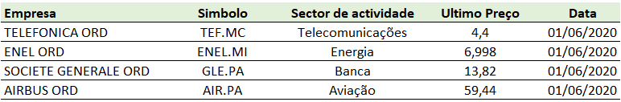

# Aplicação a dados do modelo
\endgroup
\newpage

## Introdução
```{r,include=FALSE}
rm(list = ls())
knitr::opts_chunk$set(tidy=FALSE, message = FALSE,warning =  FALSE,fig.align = "center",fig.show = "hold")
#install.packages("https://cran.r-project.org/src/contrib/Archive/fGarch/fGarch_3042.83.1.tar.gz", #repo=NULL, type="source")
#install.packages("kableExtra")
#install.packages("tidyquant")
#install.packages("MASS")
#install.packages("arsenal")
#install.packages("formatR")
#install.packages("ggfortify")
#install.packages("MFTSR", repos="http://R-Forge.R-project.org")
#install.packages("Metrics")
#install.packages("stats")
#install.packages("portes")
#install.packages("reshape2")
library(reshape2)
library(portes)
library(stats)
library(forecast)
library(Metrics)
library(fGarch)
library(MFTSR)
library(ggfortify)
library(tidyquant)
library(arsenal)
library(MASS)
library(kableExtra)
library(xlsx)
library(tidyverse)
library(RQuantLib)
```

## Análise descritiva dos dados
A primeira fase consiste em extrair de forma aleatória 4 acções constituintes do Euro Stoxx 50, estando os valores obtidos representados na figura \@ref(fig:empresas).

```{r, empresas,echo=FALSE,fig.cap='Empresas extraidas do Euro Stoxx 50',out.width="100%"}

```
\FloatBarrier
\centering 
Fonte: Elaboração própria.

\justifying
\bigskip
\scriptsize
```{r}
#leitura de simbolos dos activos financeiros
symbolsEU <- c("TEF.MC","UNA.AS",'GLE.PA',"AIR.PA")
getSymbols(symbolsEU,src = "yahoo", from="2016-06-01", to="2020-06-02")
```
\normalsize

```{r,echo=FALSE}
gle<-tail(GLE.PA)
gle <- knitr::kable(
gle, caption = "Société Générale.Euronext Paris-25-05-2020/01-06-2020",
booktabs = TRUE)
kable_styling(gle, latex_options = c("hold_position","scale_down"), position = "center")
```
\FloatBarrier
\centering 
Fonte:https://finance.yahoo.com/

\justifying
\bigskip

```{r,cotacao,echo=FALSE, fig.cap='Evolução das cotações nos últimos 5 anos',fig.topcaption = TRUE,out.width = "45%"}
par(mfrow  = c(2,2))
  chartSeries(TEF.MC,theme = chartTheme("white"))
  chartSeries(UNA.AS,theme = chartTheme("white"))
  chartSeries(GLE.PA,theme = chartTheme("white"))
  chartSeries(AIR.PA,theme = chartTheme("white"))
```
\FloatBarrier
\centering 
Fonte: Elaboração própria.

\justifying
\bigskip

```{r,echo=FALSE}
newdata <- merge(TEF.MC$TEF.MC.Adjusted,UNA.AS$UNA.AS.Adjusted,GLE.PA$GLE.PA.Adjusted,AIR.PA$AIR.PA.Adjusted)
newdata <- na.omit(newdata)
adj <- tail(newdata)
adj <- knitr::kable(
adj, caption = "Cotações a preços ajustados-25-05-2020/01-06-2020",
booktabs = TRUE)
kable_styling(adj, latex_options = "hold_position", position = "center")
```
\FloatBarrier
\centering 
Fonte:https://finance.yahoo.com/

\justifying
\bigskip

```{r, echo=FALSE}
pt <-summary(as.data.frame(newdata))
p <- knitr::kable(
pt, caption = "Estatísticas das cotações",
booktabs = TRUE)
kable_styling(p, latex_options = "hold_position", position = "center")
```
\FloatBarrier
\centering 
Fonte:Elaboração própria.

\justifying
\bigskip
```{r,echo=FALSE}
returns <- as.xts(data.frame(round(dailyReturn(newdata$TEF.MC.Adjusted,type="log"),4),round(dailyReturn(newdata$UNA.AS.Adjusted,type="log"),4),round(dailyReturn(newdata$GLE.PA.Adjusted,type="log"),4),round(dailyReturn(newdata$AIR.PA.Adjusted,type="log"),4)))
returns <- returns[-1,]
#dim(returns)
colnames(returns)<-c("TEF.RET","UNA.RET","GLE.RET","AIR.RET")
ret <- tail(returns)
retv <- knitr::kable(
ret, caption = "Retornos logarítmicos diários-25-05-2020/01-06-2020",
booktabs = TRUE)
kable_styling(retv, latex_options = "hold_position", position = "center")
```
\FloatBarrier
\centering 
Fonte:Elaboração própria.

\justifying
\bigskip
```{r, echo=FALSE}
retcor <- cor(returns)
retcork <- knitr::kable(
retcor, caption = "Matrix correlação dos retornos",
booktabs = TRUE)
kable_styling(retcork , latex_options = "hold_position", position = "center")
```
\FloatBarrier
\centering 
Fonte:Elaboração própria.

\justifying
\bigskip
```{r, echo=FALSE}
retannual <- function(x) {  
  Return.annualized(x,geometric = FALSE)}
retvol <- function(x) {  
  StdDev.annualized(x,geometric = FALSE)}

ETFStats <- do.call(data.frame, 
                    list("média anual"= round(apply(returns, 2,retannual),6),
                         "volatilidade anual"= round(apply(returns, 2, retvol),6),
                         mediana = round(apply(returns, 2, median),6),
                         skewness = round(apply(returns, 2, skewness),6),
                         kurtosis = round(apply(returns, 2, kurtosis),6),
                         min = round(apply(returns, 2, min),6),
                         max = round(apply(returns, 2, max),6)))
ETFStats<-t(ETFStats)
ETFStatsk<- knitr::kable(
ETFStats, caption = "Estatísticas dos retornos",
booktabs = TRUE)
kable_styling(ETFStatsk , latex_options = "hold_position", position = "center")
```
\FloatBarrier
\centering 
Fonte:Elaboração própria.

\justifying
\bigskip
```{r,volatilidade,echo=FALSE, fig.cap='Volatilidade nos últimos 4 anos',fig.topcaption = TRUE,out.width = "45%"}
par(mfrow  = c(2,2))
  autoplot(returns$TEF.RET,ts.colour = 'darkgreen') + ggtitle("TELEFÓNICA") + 
  ylab("Log return") + xlab("anos") + theme(plot.title = element_text(hjust = 0.5))
  autoplot(returns$UNA.RET,ts.colour = 'darkgreen') + ggtitle("UNILEVER") + 
  ylab("Log return") + xlab("anos") + theme(plot.title = element_text(hjust = 0.5))
  autoplot(returns$GLE.RET,ts.colour = 'darkgreen') + ggtitle("SOCIÉTÉ GÉNÉRALE") + 
  ylab("Log return") + xlab("anos") + theme(plot.title = element_text(hjust = 0.5))
  autoplot(returns$AIR.RET,ts.colour = 'darkgreen') + ggtitle("AIRBUS") + 
  ylab("Log return") + xlab("anos") + theme(plot.title = element_text(hjust = 0.5))
```
\FloatBarrier
\centering 
Fonte:Elaboração própria.

\justifying
\bigskip
```{r,distr,echo=FALSE, fig.cap='Distribuição dos retornos',fig.topcaption = TRUE,out.width = "100%"}
par(mfrow  = c(2,2))
  hist(returns$TEF.RET,probability=T, main="TELEFÓNICA",xlab="",breaks=100)
  lines(density(returns$TEF.RET),col=2)
  curve(dnorm(x,0,0.01695272), from = -0.06,to=0.06, col='blue',add = TRUE)
  hist(returns$UNA.RET,probability=T, main="UNILEVER",xlab="",breaks=100)
  lines(density(returns$UNA.RET),col=2)
  curve(dnorm(x,0,0.01298968), from = -0.05,to=0.05, col='blue',add = TRUE)
  hist(returns$GLE.RET,probability=T, main="SOCIÉTÉ GÉNÉRALE",xlab="",breaks=100)
  lines(density(returns$GLE.RET),col=2)
  curve(dnorm(x,0,0.02557792), from = -0.1,to=0.1, col='blue',add = TRUE)
  hist(returns$AIR.RET,probability=T, main="AIRBUS",xlab="",breaks=100)
  lines(density(returns$AIR.RET),col=2)
  curve(dnorm(x,0,0.02397011), from = -0.1,to=0.1, col='blue',add = TRUE)
```
\FloatBarrier
\centering 
Fonte:Elaboração própria.

\justifying
\bigskip
```{r,teste,echo=FALSE, fig.cap='Teste a normalidade das distribuições',fig.topcaption = TRUE,out.width = "100%"}
par(mfrow  = c(2,2))
  qqnorm(returns$TEF.RET,main="TELEFÓNICA",pch=14)
  qqline(returns$TEF.RET)
  qqnorm(returns$UNA.RET,main="UNILEVER",pch=14)
  qqline(returns$UNA.RET)
  qqnorm(returns$GLE.RET,main="SOCIÉTÉ GÉNÉRALE",pch=14)
  qqline(returns$GLE.RET)
  qqnorm(returns$AIR.RET,main="AIRBUS",pch=14)
  qqline(returns$AIR.RET)
```
\FloatBarrier
\centering 
Fonte:Elaboração própria.

\justifying
\bigskip
```{r,echo=FALSE}
lshap<- lapply(as.data.frame(returns), shapiro.test)
lres <- sapply(lshap, "[", c("statistic","p.value"))
lresk<- knitr::kable(
lres, caption = "Teste normalidade Shapiro-Wilk",
booktabs = TRUE)
kable_styling(lresk , latex_options = c("hold_position","scale_down"), position = "center")
```
\FloatBarrier
\centering 
Fonte:Elaboração própria.

\justifying
\bigskip

## EWMA

```{r,echo=FALSE}
ewma <- function(x) {  
  x<-ewmaVol(x,lambda = 0.94)
  return(tail(x$sigma,1))
  }

pewma <- do.call(data.frame, 
                    list("ewma"= round(apply(returns, 2,ewma),6)))
        
pewma<-t(pewma)
pewmak<- knitr::kable(
pewma, caption = "EWMA",
booktabs = TRUE)
kable_styling(pewmak , latex_options = "hold_position", position = "center")
```
\FloatBarrier
\centering 
Fonte:Elaboração própria.

\justifying
\bigskip

```{r,TELp,echo=FALSE, fig.cap='EWMA',fig.topcaption = TRUE,out.width = "90%"}
TEFew <- ewmaVol(returns$TEF.RET,lambda = 0.94)
UNAew <- ewmaVol(returns$UNA.RET,lambda = 0.94)
GLEew <- ewmaVol(returns$GLE.RET,lambda = 0.94)
AIRew <- ewmaVol(returns$AIR.RET,lambda = 0.94)

par(mfrow  = c(2,2))
  TEL1<-plot(returns$TEF.RET,type="l",main="Telefónica", col="green")
  TEL2<-lines(TEFew$sigma,col="red")
  TEL2
  TEL3<-plot(returns$UNA.RET,type="l",main="Unilever",col="green")
  TEL4<-lines(UNAew$sigma,col="red")
  TEL4
  TEL5<-plot(returns$GLE.RET,type="l",main="SoGen",col="green")
  TEL6<-lines(GLEew$sigma,col="red")
  TEL6
  TEL7<-plot(returns$AIR.RET,type="l",main="Airbus",col="green")
  TEL8<-lines(AIRew$sigma,col="red")
  TEL8
```
\FloatBarrier
\centering 
Fonte:Elaboração própria.

\justifying
\bigskip


## GARCH

### TELEFÓNICA

```{r,echo=FALSE,warning = FALSE}
TEF<-garchFit(formula = ~ garch(1,1),data=returns$TEF.RET,cond.dist = "std", trace=FALSE)

TEFcoef <- round(TEF@fit$matcoef,6)

TEFcoefk<- knitr::kable(
TEFcoef, caption = "TEF coeficientes",
booktabs = TRUE)
kable_styling(TEFcoefk , latex_options = "hold_position", position = "center")
```
\FloatBarrier
\centering 
Fonte:Elaboração própria.

\justifying
\bigskip

```{r,echo=FALSE}
TEFics <- TEF@fit$ics
TEFicsk<- knitr::kable(
TEFics, caption = "Information Criterion Statistics",
booktabs = TRUE)
kable_styling(TEFicsk , latex_options = "hold_position", position = "center")

pers <- TEF@fit$params$persistence
```
\FloatBarrier
\centering 
Fonte:Elaboração própria.

\justifying
\bigskip

```{r,echo=FALSE}
TEFr <-residuals(TEF, standardize = T)
TEFres <- as.data.frame(LjungBox(TEFr, lags=c(10,15,20), order=0, season=1, squared.residuals=FALSE))
TEFsre <- as.data.frame(LjungBox(TEFr^2, lags=c(10,15,20), order=0, season=1, squared.residuals=FALSE))
TEFLjun <- rbind(TEFres,TEFsre)
rownames(TEFLjun)<-c( "Ljung-Box Test 10","Ljung-Box Test 15","Ljung-Box Test 20","Ljung-Box Test 10 R^2 ","Ljung-Box Test 15 R^2","Ljung-Box Test 20 R^2")
TEFLjun$df<-NULL

TEFLjunk<- knitr::kable(
TEFLjun, caption = "Standardized Residuals Tests",
booktabs = TRUE)
kable_styling(TEFLjunk , latex_options = "hold_position", position = "center")
```
\FloatBarrier
\centering 
Fonte:Elaboração própria.

\justifying
\bigskip
```{r,TELplot,echo=FALSE, fig.cap='Telefónica',fig.topcaption = TRUE,out.width = "100%"}
par(mfrow  = c(2,2))
  plot(TEF,which= 2)
  plot(TEF,which= 3)
  plot(TEF,which=4)
  plot(TEF,which=5)
```
\FloatBarrier
\centering 
Fonte:Elaboração própria.

\justifying
\bigskip

```{r,echo=FALSE}
TEFsd <- TEF@sigma.t
TEFvol <- tail(TEFsd,1)
```

### UNILEVER

```{r,echo=FALSE,warning = FALSE}
UNA<-garchFit(formula = ~ garch(1,1),data=returns$UNA.RET,cond.dist = "std", trace=FALSE)

UNAcoef <- round(UNA@fit$matcoef,6)

UNAcoefk<- knitr::kable(
UNAcoef, caption = "UNA coeficientes",
booktabs = TRUE)
kable_styling(UNAcoefk , latex_options = "hold_position", position = "center")
```
\FloatBarrier
\centering 
Fonte:Elaboração própria.

\justifying
\bigskip

```{r,echo=FALSE}
UNAics <- UNA@fit$ics
UNAicsk<- knitr::kable(
UNAics, caption = "UNA Information Criterion Statistics",
booktabs = TRUE)
kable_styling(UNAicsk , latex_options = "hold_position", position = "center")

UNApers <- UNA@fit$params$persistence
```
\FloatBarrier
\centering 
Fonte:Elaboração própria.

\justifying
\bigskip

```{r,echo=FALSE}
UNAr <-residuals(UNA, standardize = T)
UNAres <- as.data.frame(LjungBox(UNAr, lags=c(10,15,20), order=0, season=1, squared.residuals=FALSE))
UNAsre <- as.data.frame(LjungBox(UNAr^2, lags=c(10,15,20), order=0, season=1, squared.residuals=FALSE))
UNALjun <- rbind(UNAres,UNAsre)
rownames(UNALjun)<-c( "Ljung-Box Test 10","Ljung-Box Test 15","Ljung-Box Test 20","Ljung-Box Test 10 R^2 ","Ljung-Box Test 15 R^2","Ljung-Box Test 20 R^2")
UNALjun$df<-NULL

UNALjunk<- knitr::kable(
UNALjun, caption = "UNA Standardized Residuals Tests",
booktabs = TRUE)
kable_styling(UNALjunk , latex_options = "hold_position", position = "center")
```
\FloatBarrier
\centering 
Fonte:Elaboração própria.

\justifying
\bigskip
```{r,UNAplot,echo=FALSE, fig.cap='Unilever',fig.topcaption = TRUE,out.width = "100%"}
par(mfrow  = c(2,2))
  plot(UNA,which= 2)
  plot(UNA,which= 3)
  plot(UNA,which=4)
  plot(UNA,which=5)
```
\FloatBarrier
\centering 
Fonte:Elaboração própria.

\justifying
\bigskip

```{r,echo=FALSE}
UNAsd <- UNA@sigma.t
UNAvol <- tail(UNAsd,1)
```

### SOCIÉTE GÉNÉRALE

```{r,echo=FALSE,warning = FALSE}
GLE<-garchFit(formula = ~ arma(1,0) + garch(1,1),data=returns$GLE.RET,cond.dist = "std", trace=FALSE)

GLEcoef <- round(GLE@fit$matcoef,6)

GLEcoefk<- knitr::kable(
GLEcoef, caption = "GLE coeficientes",
booktabs = TRUE)
kable_styling(GLEcoefk , latex_options = "hold_position", position = "center")
```
\FloatBarrier
\centering 
Fonte:Elaboração própria.

\justifying
\bigskip

```{r,echo=FALSE}
GLEics <- GLE@fit$ics
GLEicsk<- knitr::kable(
GLEics, caption = "GLE Information Criterion Statistics",
booktabs = TRUE)
kable_styling(GLEicsk , latex_options = "hold_position", position = "center")

GLEpers <- GLE@fit$params$persistence
```
\FloatBarrier
\centering 
Fonte:Elaboração própria.

\justifying
\bigskip

```{r,echo=FALSE}
GLEr <-residuals(GLE, standardize = T)
GLEres <- as.data.frame(LjungBox(GLEr, lags=c(10,15,20), order=0, season=1, squared.residuals=FALSE))
GLEsre <- as.data.frame(LjungBox(GLEr^2, lags=c(10,15,20), order=0, season=1, squared.residuals=FALSE))
GLELjun <- rbind(GLEres,GLEsre)
rownames(GLELjun)<-c( "Ljung-Box Test 10","Ljung-Box Test 15","Ljung-Box Test 20","Ljung-Box Test 10 R^2 ","Ljung-Box Test 15 R^2","Ljung-Box Test 20 R^2")
GLELjun$df<-NULL

GLELjunk<- knitr::kable(
GLELjun, caption = "GLE Standardized Residuals Tests",
booktabs = TRUE)
kable_styling(GLELjunk , latex_options = "hold_position", position = "center")
```
\FloatBarrier
\centering 
Fonte:Elaboração própria.

\justifying
\bigskip
```{r,GLEplot,echo=FALSE, fig.cap='Unilever',fig.topcaption = TRUE,out.width = "100%"}
par(mfrow  = c(2,2))
  plot(GLE,which= 2)
  plot(GLE,which= 3)
  plot(GLE,which=4)
  plot(GLE,which=5)
```
\FloatBarrier
\centering 
Fonte:Elaboração própria.

\justifying
\bigskip

```{r,echo=FALSE}
GLEsd <- GLE@sigma.t
GLEvol <- tail(GLEsd,1)
```

### Airbus

```{r,echo=FALSE,warning = FALSE}
AIR<-garchFit(formula = ~ arma(1,1) + garch(1,1),data=returns$AIR.RET,cond.dist = "std", trace=FALSE)

AIRcoef <- round(AIR@fit$matcoef,6)

AIRcoefk<- knitr::kable(
AIRcoef, caption = "AIR coeficientes",
booktabs = TRUE)
kable_styling(AIRcoefk , latex_options = "hold_position", position = "center")
```
\FloatBarrier
\centering 
Fonte:Elaboração própria.

\justifying
\bigskip

```{r,echo=FALSE}
AIRics <- AIR@fit$ics
AIRicsk<- knitr::kable(
AIRics, caption = "AIR Information Criterion Statistics",
booktabs = TRUE)
kable_styling(AIRicsk , latex_options = "hold_position", position = "center")

AIRpers <- AIR@fit$params$persistence
```
\FloatBarrier
\centering 
Fonte:Elaboração própria.

\justifying
\bigskip

```{r,echo=FALSE}
AIRr <-residuals(AIR, standardize = TRUE)
AIRres <- as.data.frame(LjungBox(AIRr, lags=c(10,15,20), order=0, season=1, squared.residuals=FALSE))
AIRsre <- as.data.frame(LjungBox(AIRr^2, lags=c(10,15,20), order=0, season=1, squared.residuals=FALSE))
AIRLjun <- rbind(AIRres,AIRsre)
rownames(AIRLjun)<-c( "Ljung-Box Test 10","Ljung-Box Test 15","Ljung-Box Test 20","Ljung-Box Test 10 R^2 ","Ljung-Box Test 15 R^2","Ljung-Box Test 20 R^2")
AIRLjun$df<-NULL

AIRLjunk<- knitr::kable(
AIRLjun, caption = "AIR Standardized Residuals Tests",
booktabs = TRUE)
kable_styling(AIRLjunk , latex_options = "hold_position", position = "center")
```
\FloatBarrier
\centering 
Fonte:Elaboração própria.

\justifying
\bigskip
```{r,AIRplot,echo=FALSE, fig.cap='Unilever',fig.topcaption = TRUE,out.width = "100%"}
par(mfrow  = c(2,2))
  plot(AIR,which= 2)
  plot(AIR,which= 3)
  plot(AIR,which=4)
  plot(AIR,which=5)
```
\FloatBarrier
\centering 
Fonte:Elaboração própria.

\justifying
\bigskip

```{r,echo=FALSE}
AIRsd <- AIR@sigma.t
AIRvol <- tail(AIRsd,1)
```

## Volatilidade implicita

```{r, opcao,echo=FALSE,fig.cap="Opções call sobre as empresas ",out.width="70%"}
knitr::include_graphics("image/opcao.png")
```
\FloatBarrier
\centering 
Fonte:Elaboração própria.

\justifying
\bigskip

```{r,echo=FALSE}
TEFImp <- EuropeanOptionImpliedVolatility(type="call", value = 0.27, underlying = 4.40, strike = 4.40,dividendYield = 0, riskFreeRate = -0.575, maturity = 0.31746, volatility = 0.1)
UNAImp <- EuropeanOptionImpliedVolatility(type="call", value = 2.38, underlying = 46.66, strike = 46,dividendYield = 0, riskFreeRate = -0.575, maturity = 0.31746, volatility = 0.1)
SOGImp <- EuropeanOptionImpliedVolatility(type="call", value = 1.62, underlying = 13.82, strike = 14,dividendYield = 0, riskFreeRate = -0.575, maturity = 0.31746, volatility = 0.1)
AIRImp <- EuropeanOptionImpliedVolatility(type="call", value = 6.91, underlying = 59.44, strike = 60,dividendYield = 0, riskFreeRate = -0.575, maturity = 0.31746, volatility = 0.1)

TEFImp <- round(TEFImp[]/sqrt(252),6)
UNAImp<-round(UNAImp[]/sqrt(252),6)
SOGImp<-round(SOGImp[]/sqrt(252),6)
AIRImp<-round(AIRImp[]/sqrt(252),6)

pimpvol<-cbind(TEFImp,UNAImp,SOGImp,AIRImp)
colnames(pimpvol)<-c("TEF.RET","UNA.RET","GLE.RET","AIR.RET")
rownames(pimpvol)<-"Volatilidade implícita"

pimpvolk<- knitr::kable(
pimpvol, caption = "Volatilidade Implícita",
booktabs = TRUE)
kable_styling(pimpvolk , latex_options = c("hold_position","scale_down"), position = "center")
```
\FloatBarrier
\centering 
Fonte:Elaboração própria.

\justifying
\bigskip

## Simulação


