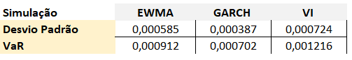
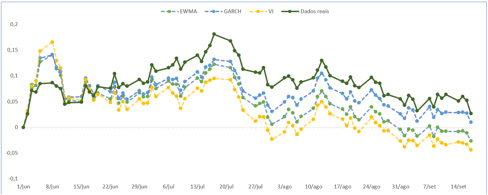

# Apresentação dos resultados
\endgroup
\newpage

## Apresentação dos resultados

```{r, echo=FALSE}
TEF.MC.R <-read_xlsx ("data/TEF.MC.R.xlsx")
TEF.MC.R <- xts(TEF.MC.R[, -1], order.by=as.Date(TEF.MC.R$Date))
GLE.PA.R <-read_xlsx ("data/GLE.PA.R.xlsx")
GLE.PA.R <- xts(GLE.PA.R[, -1], order.by=as.Date(GLE.PA.R$Date))
ENEL.MI.R <-read_xlsx ("data/ENEL.MI.R.xlsx")
ENEL.MI.R <- xts(ENEL.MI.R[, -1], order.by=as.Date(ENEL.MI.R$Date))
AIR.PA.R <-read_xlsx ("data/AIR.PA.R.xlsx")
AIR.PA.R <- xts(AIR.PA.R[, -1], order.by=as.Date(AIR.PA.R$Date))

myPortfolioR <-na.omit(merge(TEF.MC.R$`Adj Close`,ENEL.MI.R$`Adj Close`,GLE.PA.R$`Adj Close`,
                             AIR.PA.R$`Adj Close`))

myPortfolioReturnsR <- ROC(myPortfolioR,type="discrete")[-1,]
colnames(myPortfolioReturnsR) <- c("RealTEF","RealENEL","RealGLE","RealAIR")
```

Os resultados obtidos estão ilustrados nas tabelas e gráficos apresentados seguidamente, em que na figura \@ref(fig:umdesvio) se apresentam os valores de desvio padrão para os retornos de cada uma das empresas em estudo. Este valores são da maior importância, pois têm grande impacto na simulação de monte carlo realizada e, deste modo, nos valores obtidos para os 80 dias em estudo.

Os valore de desvio padrão são os obtidos ao dia 01/06/2020 de acordo com dados históricos para os modelos EWMA e GARCH, sendo que os obtidos pelo modelo da volatilidade implícita são os valores esperados pelos participantes no mercado financeiro para as opções do activos em estudo.

Ao analisar os valores para cada um dos métodos não se pode afirmar que um dos métodos tivesse fornecido valores de desvio padrão superiores ao de outro método. Ao analisar por empresas, Société Générale é a que apresenta valores mais elevados de desvio padrão diário, sendo que a empresa Enel apresenta valores de desvio padrão diários inferiores às restantes empresas. Como o objectivo na modelação do portfolio é minimizar a variância total, é de esperar um maior peso da empresa Enel em todos os modelos desenvolvidos.

```{r,umdesvio,echo=FALSE,fig.cap='Valores de desvio padrão calculados por modelo',out.width="80%"}

```
\FloatBarrier
\centering 
Fonte:Elaboração própria.

\justifying
\bigskip

A figura \@ref(fig:umpeso) apresenta os pesos de cada um dos activos para cada modelo de portfólio. Como seria de esperar em todos eles a empresa Enel é a que apresenta uma maior representação, sendo que a empresa Société Générale, devido ao risco acrescido que apresenta é a que menos representação têm, não estando presente no portefólio desenvolvido a partir dos valores obtidos pelo modelo GARCH.

```{r,umpeso,echo=FALSE,fig.cap='Pesos de cada um dos activos nos portfólios',out.width="80%"}

```
\FloatBarrier
\centering 
Fonte:Elaboração própria.

\justifying
\bigskip

Na obtenção dos vários modelos pretendíamos também analisar qual é que seria o modelo que apresentaria menos risco para o investidor através da análise do VaR. Como o VaR está relacionado com o desvio padrão, quanto maior o valor deste último, maior o valor em risco para o investidor. Nos portefólios obtidos com os dados simulados, e de acordo com a figura \@ref(fig:umsim), o modelo GARCH é o que apresenta valores mais baixos, tanto para a variância como para o VaR a um dia. Tendo em consideração que um dos objectivos é a optimização de um portfólio minimizando o risco, de acordo com os dados apresentados, o modelo GARCH é o que apresenta uma melhor resposta ao risco, sendo que o VaR é o menor de entre os vários modelos.

```{r,umsim,echo=FALSE,fig.cap='Estatísticas dos portfólios com dados simulados',out.width="80%"}

```
\FloatBarrier
\centering 
Fonte:Elaboração própria.

\justifying
\bigskip

A apresentação dos valores nas tabelas acima, recaíram sobre os dados obtidos pelos vários modelos, assim como pelas simulações. Na figura \@ref(fig:dias) temos a aplicação dos pesos obtidos pelas simulações aos valores reais ao longo dos 80 dias de cotação, ou seja, até ao vencimento das opções a 18/09/2020.

Nesses dados podemos verificar que a aplicação do pesos obtidos pelo modelo GARCH continua a ser o que apresenta menor risco para o investidor, sendo que o modelo obtido através da volatilidade implícita apresenta o maior risco. A coluna referente aos dados reais são referentes a obtenção de um portefólio que minimize a variância, utilizando os dados das cotações das empresa nesses 80 dias, comparando deste modo com os valores obtidos pelos portefólios das simulações quando aplicados aos dados reais das cotações das empresas em estudo. 

```{r,dias,echo=FALSE,fig.cap='Estatísticas do modelo aplicando dados cotações',out.width="80%"}
knitr::include_graphics("image/dadosreais80dias.png")
```
\FloatBarrier
\centering 
Fonte:Elaboração própria.

\justifying
\bigskip

Na figura \@ref(fig:grafico) podemos ver a evolução do valor dos vários portfólios versus o modelo obtido através dos dados reais. A tendência ao longo do tempo dos 3 modelos versus o modelo dos dados reais parecem em sintonia, sendo que apenas no inicio a tendência do portfólio real apresenta uma menor oscilação, sendo que depois se sobrepõe aos modelos. 

De uma forma geral a tendência parece ser bastante similar ao longo dos 80 dias. 

```{r,grafico,echo=FALSE,fig.cap='Evolução dos portfolios ao longo dos 80 dias',out.width="100%"}

```
\FloatBarrier
\centering 
Fonte:Elaboração própria.

\justifying
\bigskip

Quando analisamos os erros dos vários modelos comparativamente ao modelo real (figura \@ref{ref:mae}, verificamos que o modelo que se aproxima mais do modelo real é o modelo desenvolvimento através da simulação GARCH. A previsão que apresenta uma maior discrepância relativo ao modelo real é o modelo da volatilidade implícita. 

```{r,mae,echo=FALSE,fig.cap='Métricas para qualidade do ajuste',out.width="80%"}

```
\FloatBarrier
\centering 
Fonte:Elaboração própria.

\justifying
\bigskip

A evolução dos retornos diários encontra-se ilustrados na figura \@ref(fig:retggplot) para os vários modelos, apresentando, como verificado anteriormente a mesma tendência oa longo do tempo, havendo mesmo vários pontos de sobreposição.

```{r, echo=FALSE,warning = FALSE}
SimReturnsRvi <- as.timeSeries(myPortfolioReturnsR)
equalweightsvi <- Return.portfolio(SimReturnsRvi,weights = c(0.3278427, 0.4001305, 0.1278029, 0.1442238)) 
realvi <- equalweightsvi$portfolio.returns
```


```{r, echo=FALSE}
SimReturnsRgarch <- as.timeSeries(myPortfolioReturnsR)
equalweightsgarch <- Return.portfolio(SimReturnsRgarch,weights = c(0.2136498, 0.6196197, 0, 0.1667305)) 
realgarch<-equalweightsgarch$portfolio.returns
```


```{r, echo=FALSE}

SimReturnsRewma <- as.timeSeries(myPortfolioReturnsR)
equalweightsewma <- Return.portfolio(SimReturnsRewma,weights = c(0.2502928, 0.5540359, 0.1141192, 0.0815521)) 
realewma<-equalweightsewma$portfolio.returns
```

```{r, echo=FALSE}
RealReturns <- as.timeSeries(myPortfolioReturnsR)
minvarRR <- minvariancePortfolio(RealReturns) 
```

```{r, echo=FALSE}
SimReturnsReal <- as.timeSeries(myPortfolioReturnsR)
equalweightreal <- Return.portfolio(SimReturnsReal,weights = c(0.08775736, 0.91224264, 0, 0)) 
real<-equalweightreal$portfolio.returns
```

```{r,echo=FALSE}
realones <-na.omit(merge(real$portfolio.returns,realewma$portfolio.returns,realgarch$portfolio.returns,realvi$portfolio.returns))
colnames(realones) <- c("Real","Realewma","Realgarch","Realvi")
```

```{r,retggplot,echo=FALSE, fig.cap='Retornos dos portfólios - 80 dias',fig.topcaption = TRUE,out.width = "100%"}
realones<-data.frame(date = index(realones),realones, row.names=NULL)

ggplot(data=realones)+
  geom_line(mapping=aes(y=Real,x= date,color="real"),size=1 ) +
  geom_line(mapping=aes(y=Realgarch,x=date,color="garch"),size=1) +
  geom_line(mapping=aes(y=Realewma,x=date,color="ewma"),size=1) +
  geom_line(mapping=aes(y=Realvi,x=date,color="vi"),size=1,linetype="dashed") +
  scale_color_manual(values = c(
    'real' = "black",
    'garch' = 'darkblue',
    'ewma' = 'darkred',
    "vi"="springgreen")) +
  labs(color = 'Y series')
```
\FloatBarrier
\centering 
Fonte:Elaboração própria.

\justifying
\bigskip
